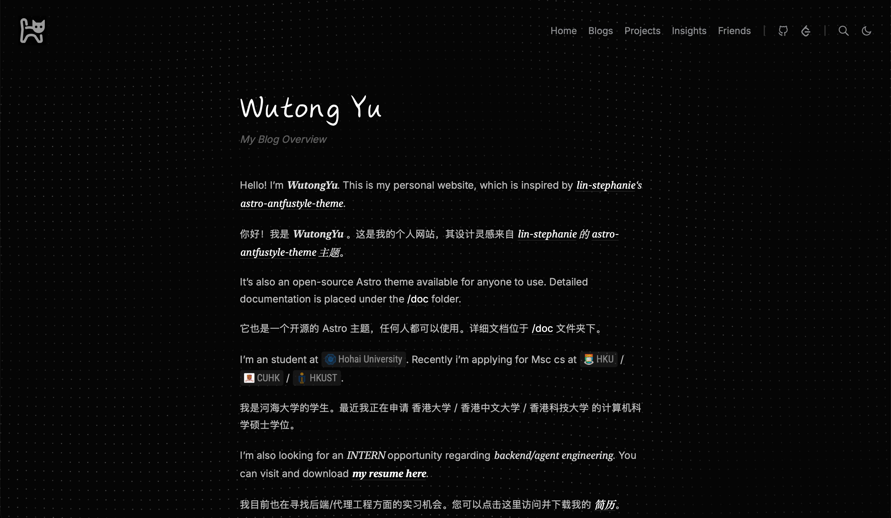
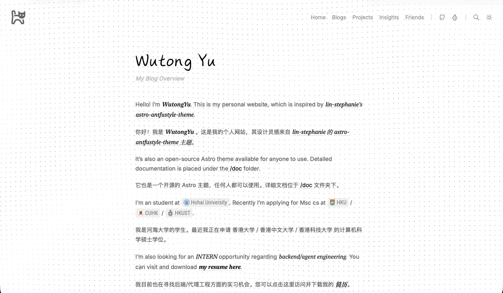
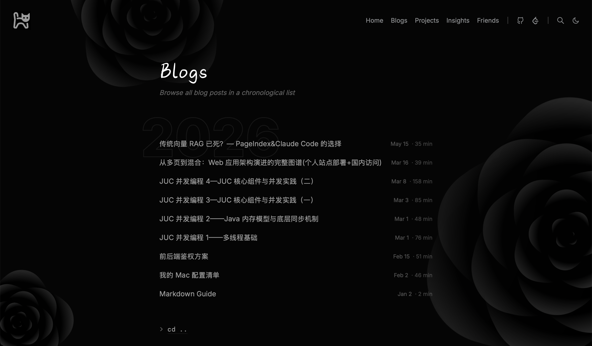
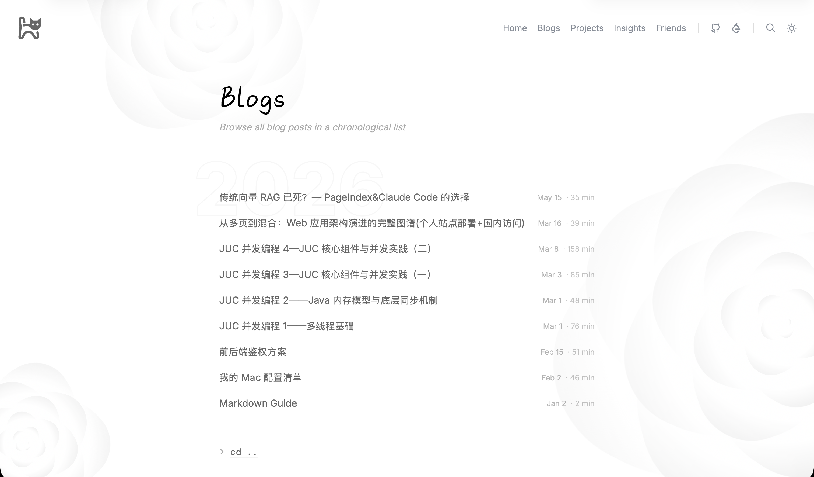
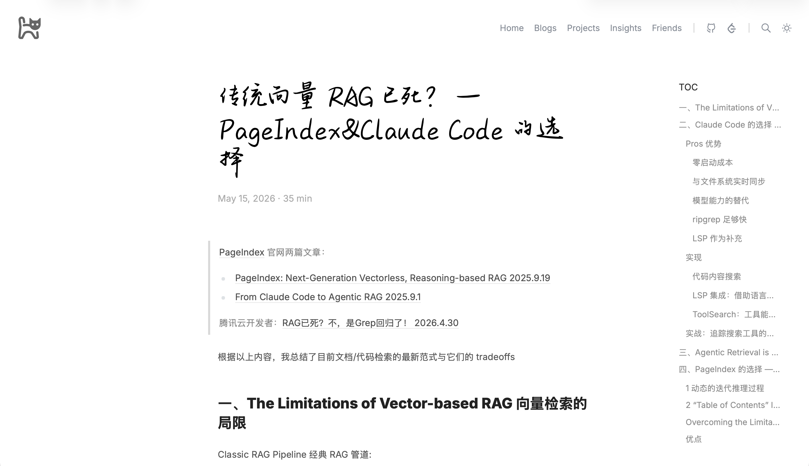
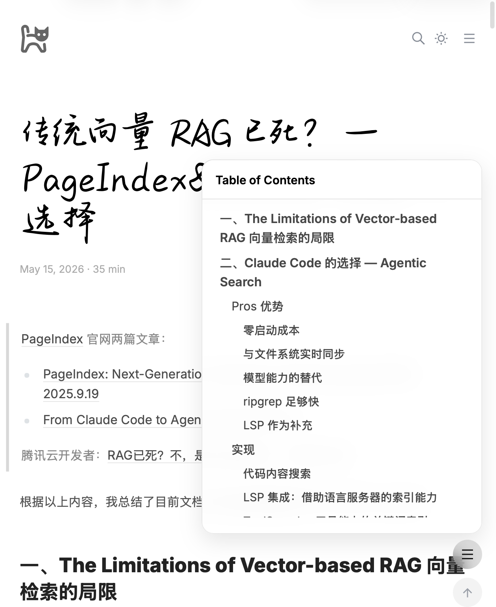
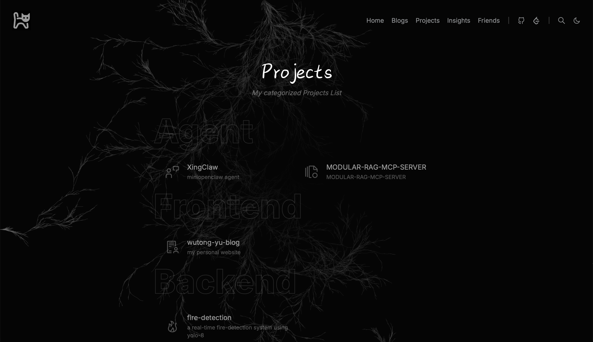
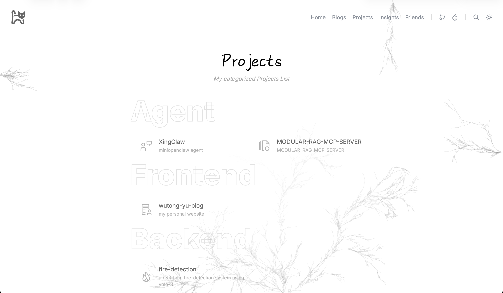

# Wutong-Yu-Blog

[English](README_ENG.md) | [1w5+字数博客项目解析，深入了解 Astro](doc/)

[](https://astro.build)
[](https://www.typescriptlang.org)
[](https://unocss.dev)
[](https://mdxjs.com)
[](https://pagefind.app)
[](https://pnpm.io)
[](LICENSE)

一个精简的 Astro 5 个人站点，视觉风格受 Antfu 风格启发。专注于一个小而精的功能集：首页 Home、博客 Blogs、项目 Projects、启发 Insights、友链 Friends 和搜索 Search，保持代码库易于扩展。

## Home 页面





## Blogs 页面





### blog 单页宽页面



### 窄页面



## Projects 页面





## Insights 页面


## Friends 页面


## 概览

- 框架：Astro 5 + TypeScript
- 样式：UnoCSS + 自定义 CSS
- 内容：通过 Astro Content Collections 管理 Markdown / MDX
- 搜索：Pagefind（仅限博客）
- 体验：支持明/暗主题切换与视图转场
- 内容增强：文章目录、阅读友好的博客排版、自动生成 OG 图片

## 功能亮点

- 首页 `/`
- 博客索引 `/blogs/` 与文章页 `/blogs/[slug]/`
- 项目展示页 `/projects/`
- Insights 页 `/insights/`，按年份分组的时间线展示语录、启发与反思，支持正文预览展开、可选配图和 `snow` 背景
- Friends 页 `/friends/`，按分类展示友链卡片，包含申请友链说明区块，并适配明暗主题
- 基于 Pagefind 的博客全文搜索
- 文章详情页右侧目录
- 文章与核心页面的自动 OG 图片生成
- 四种内置背景效果：`plum`、`dot`、`rose`、`snow`
- 统一的配置文件控制社交链接与导航栏

## 技术栈

- `astro` — 路由、静态生成与内容渲染
- `@astrojs/mdx` — MDX 支持
- `unocss` — 原子化 CSS
- `astro-expressive-code` — 代码块语法高亮
- `pagefind` — 静态搜索索引
- `sharp` + `satori` — 图片处理与 OG 图片生成
- `eslint` + `prettier` — 代码质量与格式化

## 环境要求

- Node.js `18.20.8`、`20.9.0+` 或 `22+`
- `pnpm@10.28.0`

## 快速开始

```bash
pnpm install
pnpm dev
```

然后在终端中打开 Astro 开发服务器地址即可。

## 可用命令

```bash
pnpm dev          # 启动本地开发服务器
pnpm check        # 运行 Astro 类型与内容检查
pnpm build        # 生成生产环境构建产物
pnpm preview      # 本地预览生产构建
pnpm lint         # 运行 ESLint 检查
pnpm lint:fix     # 自动修复 lint 问题
pnpm format       # 检查代码格式（Prettier）
pnpm format:write # 格式化代码（Prettier）
```

## 路由

| 路由 | 用途 |
| :--- | :--- |
| `/` | 首页 |
| `/blogs/` | 博客索引页 |
| `/blogs/[slug]/` | 博客文章详情页 |
| `/projects/` | 项目展示页 |
| `/insights/` | Insights 页：按年份时间线展示语录、启发与反思，支持正文预览展开、可选配图与 `snow` 背景 |
| `/friends/` | Friends 页：按分类展示友情链接卡片，支持申请友链说明与页面级 `cd ..` 对齐 |
| `/search/` | 基于 Pagefind 的搜索页 |

## 内容与定制

| 文件 | 用途 |
| :--- | :--- |
| `src/content/home/index.md` | 首页正文内容 |
| `src/content/blogs/**/*.{md,mdx}` | 博客文章，渲染在 `/blogs/` 下 |
| `src/content/projects/data.json` | 项目卡片数据 |
| `src/content/insights/**/*.{md,mdx}` | Insight 条目（语录、启发、反思） |
| `src/content/friends/data.json` | 友链卡片数据 |
| `src/content/schema.ts` | 内容集合的 schema 定义（页面、文章、项目、Insight、Friend） |
| `src/config.ts` | 站点元信息、导航项、社交链接与功能开关 |
| `astro.config.ts` | Astro 集成配置、Markdown 管线、图片优化与构建设置 |

### 主要配置入口

- `src/config.ts` 中的 `SITE`：网站 URL、标题、描述、语言地区、图片域名
- `src/config.ts` 中的 `UI`：内部导航、社交链接、导航栏布局、文章/项目展示规则
- `src/config.ts` 中的 `FEATURES`：目录、搜索、入场动画、OG 图片默认配置

## 项目结构

```text
src/
  components/
    backgrounds/  # Background, Dot, Plum, Rose, Snow
    base/         # Head, Link, Footer, Backdrop, PostMeta, Divider
    nav/          # NavBar, NavItem, NavSwitch
    toc/          # Toc, TocSidebar, TocItem
    views/        # RenderPage, RenderPost, ListView, GroupView, InsightsView, FriendsView
    widgets/      # LogoButton, SearchSwitch, ThemeSwitch, BackLink
  content/
    blogs/        # 博客文章（Markdown / MDX）
    home/         # 首页内容
    projects/     # 项目数据（JSON）
    insights/     # Insight 条目，按年份归档（Markdown）
    friends/      # 友链数据（JSON）
    schema.ts     # 所有内容集合的 Zod schema 定义
  layouts/        # BaseLayout, StandardLayout
  pages/          # 路由定义
  styles/         # main.css, prose.css, markdown.css
  utils/          # 路径、日期、数据、杂项、目录工具函数
plugins/          # remark/rehype 插件、OG 辅助
public/           # 静态资源：favicon、字体、生成的图片等
doc/              # 项目笔记与定制说明文档
```

## 架构说明

**内容流转链路**

```text
src/content/*                -> 原始 Markdown / MDX / JSON 内容
src/content.config.ts        -> schema 校验与解析
astro.config.ts + plugins/*  -> Markdown / MDX 处理
src/pages/*                  -> 路由生成
src/layouts/*                -> 页面外壳
src/components/views/*       -> 页面级组合
src/components/* + styles/*  -> 最终 UI 输出
```

**横切关注点文件**

- `src/config.ts` 集中管理站点、UI 与功能配置
- `src/types.ts` 定义共享的 TypeScript 类型（包含 `BgType` 背景类型枚举）

## 文档

项目相关说明文档存放在 `doc/` 目录下：

- `doc/项目解析.md` — 完整的项目架构与数据流分析
- `doc/feature/Insights模块更新说明.md` — Insights 模块设计、内容链路与维护指南
- `doc/feature/友链模块说明.md` — Friends 模块结构、数据链路与维护说明
- `doc/feature/文章TOC与响应式导航说明.md` — 目录行为与响应式导航细节
- `doc/notes/Insights页面展开收起与字体说明.md` — Insights 页面最近的展开收起、字体与排版说明
- `doc/notes/页面调整.md` — 博客阅读体验与页面级调整
- `doc/notes/页面间距统一.md` — 页面间距修复记录
- `doc/notes/LogoButton图标替换说明.md` — Logo 从文字替换为 SVG 及主题切换适配
- `doc/notes/字体修改.md` — 本地字体的添加与应用

## 定位

本仓库是从原始 `astro-antfustyle-theme` 剪裁而来的变体，去掉了与个人使用场景关联度较低的模块，保留了更小、更易维护的功能面。

已移除或排除的部分：

- 照片、短片、更新日志、信息流、串流、发布说明、Pull Request 等额外页面
- GitHub 活动、RSS、Bluesky、评论等未使用的集成
- 上游模板元数据和面向演示的示例素材

保留的核心体验：

- 首页、博客列表、博客详情、项目展示、Insights、Friends 和搜索
- 基于配置文件驱动的社交链接与导航栏布局
- 仅限博客的 Pagefind 搜索
- 文章页目录
- 明暗主题切换与视图转场
- 活跃页面与文章的 OG 图片自动生成
- 多种背景效果（`plum`、`dot`、`rose`、`snow`）
