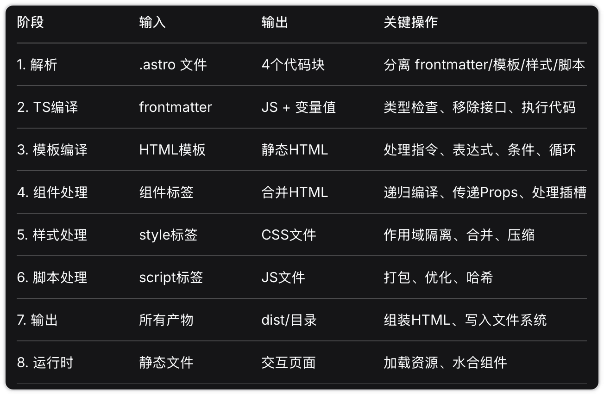
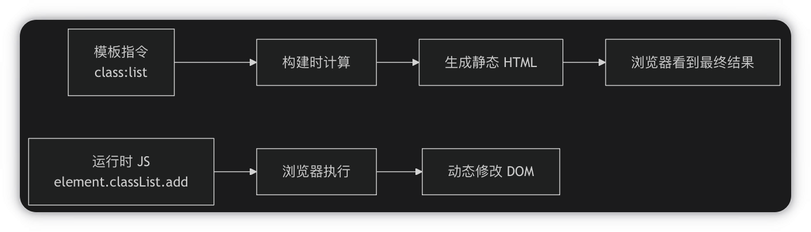
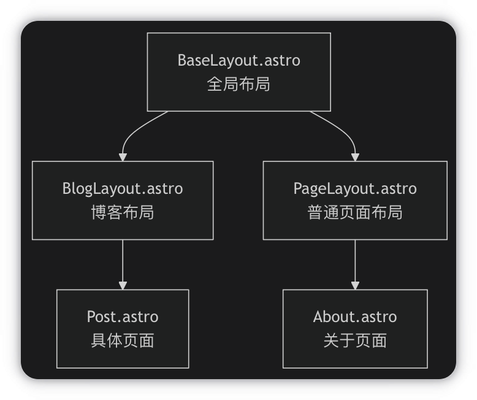
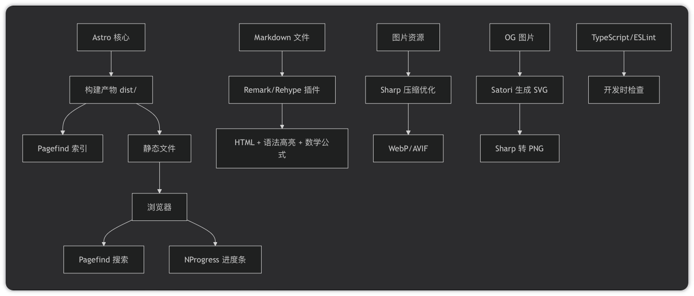
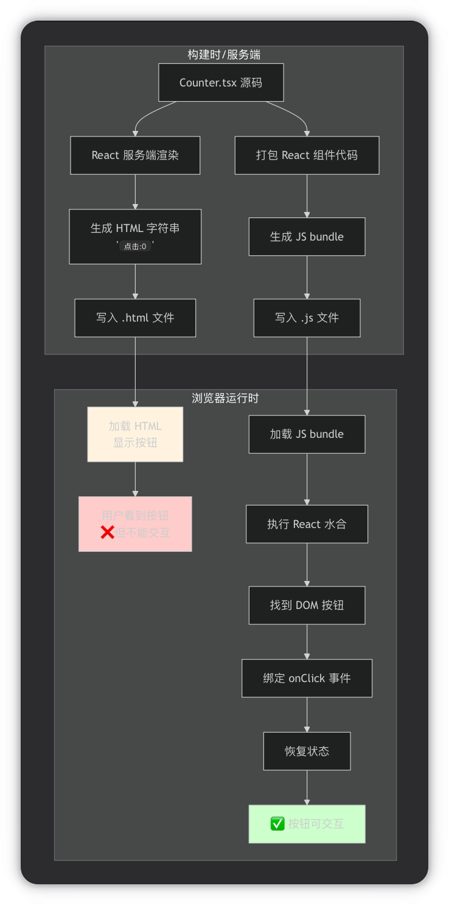

# `wutong-yu` 项目解析（读到依赖`@astrojs/check`，最后面有bug）

> 本文目标是用“代码现在实际怎样工作”的方式，完整说明这个项目的目录结构、每层职责、调用链路、使用方法、构建与搜索行为，以及当前仍存在的注意事项。

## 前端开发核心概念

| 概念                  | 类比                | 作用                                    |
| ------------------- | ----------------- | ------------------------------------- |
| **HTML**            | 房子的结构（墙、门、窗）      | 网页的骨架，定义内容是什么                         |
| **CSS**             | 装修（墙漆、窗帘、地板）      | 控制样式、位置、颜色、动画                         |
| **JavaScript**      | 电器和智能家居（开关、感应器）   | 让网页有交互：点击、拖拽、数据请求等                    |
| **组件化**             | 预制好的部件（门、窗、卫生间模块） | 把页面拆成可复用的小块，比如：Header、PostCard、Footer |
| **UI框架（React/Vue）** | 高级工具包（智能灯具+开关系统）  | 用组件方式高效开发复杂交互，自动更新页面                  |
| **路由**              | 房间的门牌号和走廊         | 根据URL显示不同内容，比如 `/about` 显示关于页面        |
| **构建/打包**           | 把材料预制、切割、组合       | 将源码转换为浏览器能运行的最终文件（优化、压缩）              |
| **SSG（静态站点生成）**     | 提前把每个房间装修好，放在仓库   | 构建时生成所有HTML，访问时直接给文件（超快）              |
| **SSR（服务端渲染）**      | 有人敲门时现场装修         | 请求到来时动态生成HTML（灵活，但稍慢）                 |
| **CSR（客户端渲染）**      | 只给个空房子，让用户自己装     | 浏览器下载JS后动态渲染（首屏慢，但交互强）                |

## Astro 框架

| 工具            | 类型          | 特点                           | 适用场景                |
| ------------- | ----------- | ---------------------------- | ------------------- |
| **Astro**     | 群岛架构 SSG    | 默认零 JS，按需加载交互组件，支持多框架        | 博客、文档、电商详情页、内容站     |
| **Next.js**   | React 全栈框架  | 支持 SSR/SSG/CSR，所有页面都依赖 React | 复杂 web 应用（仪表盘、后台管理） |
| **Gatsby**    | React 静态站点  | 全站 React 组件，但会发送大量 JS        | 内容型站点（曾经流行，现在偏重）    |
| **Hugo**      | 传统 SSG      | 无 JS 运行时，使用 Go 语言，构建极快       | 纯内容型博客、文档（没有交互组件）   |
| **VitePress** | Vue 驱动的 SSG | 专为文档设计，轻量                    | 技术文档                |

| 工具        | 底层构建引擎              | 是否基于 Vite? | 备注                        |
| --------- | ------------------- | ---------- | ------------------------- |
| Astro     | Vite                | ✅ 是        | 原生集成                      |
| VitePress | Vite                | ✅ 是        | 专为 Vite 而生                |
| Next.js   | Turbopack / Webpack | ⚠️ 正在迁移    | Turbopack 是 Vite 作者的下一个项目 |
| Gatsby    | Webpack             | ❌ 否        | 上一代技术                     |
| Hugo      | Go (原生二进制)          | ❌ 否        | 完全不依赖 JS 生态               |

- Vite（法语意为“快”）是一个**下一代的前端构建工具**，负责启动服务器、编译代码、打包项目。利用浏览器原生支持 ES 模块（ESM）的特性，**只在浏览器请求时才处理文件**
- **插件钩子**是 Vite 暴露给插件开发者的 API 接口。Vite 在构建流程的每一个环节（比如：服务器启动前、文件读取时、代码转换时、打包结束时）都埋下了“钩子”。
- **Astro = Vite + Astro 特有的功能（Markdown、 Islands 架构等）**

### 地基：Node.js 运行环境

这是整个项目的基础，相当于建筑的**地基和水电系统**。

- **角色：** JavaScript 的运行环境。
- **作用：** 它让你的 JavaScript 代码可以脱离浏览器，在你的电脑上运行。它提供了文件系统读写、网络服务、进程管理等核心能力。没有它，任何现代前端工具都无法启动。

### 物资与后勤：npm (包管理器)

有了地基，就需要运送和管理建筑材料。npm 就是**物资总管和物流中心**。

- **角色：** Node.js 的包管理器。
- **作用：** 它负责安装、下载和管理项目所需的所有“积木”，比如 Vite、React、Vue、UnoCSS 等。当你执行 `npm install` 时，它就把所有依赖都运送到你的项目里。

### 总工程师与翻译官：Vite (构建工具)

地基和材料都准备好了，现在需要一位总工程师来指挥施工。Vite 就是这位**总工程师兼翻译官**。

- **角色：** 前端构建工具。
- **作用：**
  1. **开发时 (翻译官)：** 它启动一个本地服务器，把你写的现代代码（如 TypeScript, `.vue`/`.astro` 组件）**实时翻译**成浏览器能看懂的 HTML/CSS/JS，并实现秒级热更新。
  2. **生产时 (总工程师)：** 当你准备发布项目时，它会指挥 Rollup 等工具，对你的代码进行优化、压缩、打包，生成最终可以部署的静态文件。

**关键点：** Vite 本身就是一个用 JavaScript 编写的程序，它必须在 **Node.js** 这个环境中才能运行。

### 建筑主体：应用框架 (React/Vue/Astro)

这是你真正居住和使用的部分，也就是建筑的**主体结构**。

- **角色：** UI 框架或元框架。
- **作用：** 你使用 React、Vue 或 Astro 的语法来编写用户界面和业务逻辑。这些框架的代码（如 `.jsx`, `.vue`, `.astro` 文件）是“原材料”，需要交给 Vite 这位“翻译官”进行处理。

### 室内装修：UI 库与样式 (UnoCSS, Ant Design...)

最后是室内装修，让建筑变得美观和可用。

- **角色：** UI 组件库、CSS 框架。
- **作用：** 比如你使用的 UnoCSS，它通过 Vite 插件的形式，为你的项目提供原子化的 CSS 样式，相当于快速、灵活的装修风格。

所以，当你运行 `npm run dev` 时，实际发生的是：

1. `npm` 在 **Node.js** 环境中执行一个脚本。
2. 这个脚本启动了 **Vite** 程序。
3. **Vite** 读取你的 **Astro/React/Vue** 代码。
4. **Vite** 调用 **UnoCSS** 等插件处理样式。
5. **Vite** 将最终结果提供给浏览器显示。

## astro 语法

.astro 是**增强版 HTML** - 可以写逻辑、导入组件、自动优化，但最终生成纯 HTML

```
---
// .astro 文件 - 多了这些
// 1. 代码块（运行在服务端）
const name = 'World'
const users = ['Alice', 'Bob', 'Charlie']
---

<!-- 2. 模板语法 - 可以嵌入 JavaScript 表达式 -->
<h1>Hello {name}</h1>

<!-- 3. 动态渲染列表 -->
<ul>
  {users.map(user => <li>{user}</li>)}
</ul>

<!-- 4. 条件渲染 -->
{users.length > 0 ? (
  <p>有 {users.length} 个用户</p>
) : (
  <p>暂无用户</p>
)}

<!-- 5. 导入其他组件 -->
<NavBar />

<!-- 6. 作用域样式 -->
<style>
  /* 这个样式只影响本组件 */
  h1 { color: red; }
</style>

<!-- 7. 客户端脚本 -->
<script>
  console.log('运行在浏览器')
</script>
```



```
┌─────────────────────────────────────────────────────────────────────────────┐
│ 阶段 0：源代码输入                                                          │
├─────────────────────────────────────────────────────────────────────────────┤
│                                                                             │
│   Button.astro                                                              │
│   ┌─────────────────────────────────────────┐                              │
│   │ ---                                    │                              │
│   │ import Base from './Base.astro'       │                              │
│   │ interface Props { variant?: string }  │                              │
│   │ const { variant = 'primary' } = Astro.props                         │
│   │ ---                                    │                              │
│   │ <button class:active={true}>Click</button>                           │
│   │ <style>.btn { color: red; }</style>    │                              │
│   └─────────────────────────────────────────┘                              │
│                                                                             │
└─────────────────────────────────────────────────────────────────────────────┘
                                    │
                                    ▼
┌─────────────────────────────────────────────────────────────────────────────┐
│ 阶段 1：文件解析                                                            │
├─────────────────────────────────────────────────────────────────────────────┤
│                                                                             │
│   Astro 编译器读取 .astro 文件，识别四个部分：                               │
│                                                                             │
│   ┌──────────────────┐                                                     │
│   │ 1. Frontmatter   │  --- ... ---  (组件脚本，服务端执行)                 │
│   ├──────────────────┤                                                     │
│   │ 2. HTML 模板     │  <button>...</button> (UI 模板)                     │
│   ├──────────────────┤                                                     │
│ │ 3. Style 块   │  <style>...</style> (组件样式)                         │
│   ├──────────────────┤                                                     │
│   │ 4. Script 块     │  <script>...</script> (客户端脚本)                  │
│   └──────────────────┘                                                     │
│                                                                             │
└─────────────────────────────────────────────────────────────────────────────┘
                                    │
                                    ▼
┌─────────────────────────────────────────────────────────────────────────────┐
│ 阶段 2：TypeScript 编译（Frontmatter 处理）                                 │
├─────────────────────────────────────────────────────────────────────────────┤
│                                                                             │
│   ┌─────────────────────────────────────────────────────────────────────┐ │
│   │ 步骤 2.1：识别代码类型                                               │ │
│   │                                                                     │ │
│   │   interface Props { variant?: string }  → 类型定义                   │ │
│   │   import Base from './Base.astro'       → 实际代码                   │ │
│   │   const { variant } = Astro.props       → 实际代码                   │ │
│   └─────────────────────────────────────────────────────────────────────┘ │
│                                    │                                        │
│                                    ▼                                        │
│   ┌─────────────────────────────────────────────────────────────────────┐ │
│   │ 步骤 2.2：类型检查                                                   │ │
│   │                                                                     │ │
│   │   TypeScript 检查 interface 定义是否正确                            │ │
│   │   • variant 类型是否匹配？                                          │ │
│   │   • 导入的模块是否存在？                                            │ │
│   │                                                                     │ │
│   │   ✅ 通过 → 继续                                                    │ │
│   │   ❌ 失败 → 报错，停止构建                                          │ │
│   └─────────────────────────────────────────────────────────────────────┘ │
│                                    │                                        │
│                                    ▼                                        │
│   ┌─────────────────────────────────────────────────────────────────────┐ │
│   │ 步骤 2.3：编译转换                                                   │ │
│   │                                                                     │ │
│   │   移除所有类型定义（interface/type）                                │ │
│   │   将 TypeScript 语法编译为 JavaScript                               │ │
│   │   执行代码，收集：                                                  │ │
│   │     • Props 定义                                                    │ │
│   │       • 组件需要接收哪些 Props？                                    │ │
│   │       • 哪些 Props 有默认值？                                       │ │
│   │     • 变量值（如 variant = 'primary'）                              │ │
│   │                                                                     │ │
│   │   输出：JavaScript 逻辑代码                                         │ │
│   └─────────────────────────────────────────────────────────────────────┘ │
│                                                                             │
└─────────────────────────────────────────────────────────────────────────────┘
                                    │
                                    ▼
┌─────────────────────────────────────────────────────────────────────────────┐
│ 阶段 3：模板编译（HTML 模板处理）                                           │
├─────────────────────────────────────────────────────────────────────────────┤
│                                                                             │
│   遍历 HTML 模板，识别并处理以下语法：                                       │
│                                                                             │
│   ┌─────────────────────────────────────────────────────────────────────┐  │
│   │ 类型 A：Astro 指令                                                  │  │
│   ├─────────────────────────────────────────────────────────────────────┤  │
│   │                                                                      │  │
│   │  A1. class:list                                     │  │
│   │      <div class:list={['base', isActive && 'active']}>              │  │
│   │      → 计算数组：['base', true && 'active'] → ['base', 'active']    │  │
│   │      → 生成：<div class="base active">                              │  │
│   │                                                                      │  │
│   │  A2. set:html / set:text                                            │  │
│   │      <div set:html={htmlString} />                                  │  │
│   │      → 验证 HTML 安全性                                             │  │
│   │      → 直接插入 HTML 字符串                                         │  │
│   │                                                                      │  │
│   │  A3. client:*（客户端指令）                                         │  │
│   │      <Interactive client:load />                                    │  │
│   │      → 标记为需要客户端激活                                         │  │
│   │      → 生成占位符 <astro-island>                                   │  │
│   │      → 记录组件路径和 Props                                         │  │
│   │                                                                      │  │
│   │  A4. transition:*（视图过渡）                                       │  │
│   │      <div transition:name="hero">                                   │  │
│   │      → 添加视图过渡标记                                             │  │
│   └─────────────────────────────────────────────────────────────────────┘  │
│                                                                             │
│   ┌─────────────────────────────────────────────────────────────────────┐  │
│   │ 类型 B：JavaScript 表达式                                           │  │
│   ├─────────────────────────────────────────────────────────────────────┤  │
│   │                                                                      │  │
│   │  B1. 变量插值 {variable}                                           │  │
│   │      <h1>{title}</h1>                                              │  │
│   │      → 替换为变量的值                                              │  │
│   │                                                                      │  │
│   │  B2. 条件渲染 {condition && <div />}                               │  │
│   │      {isLoggedIn && <span>欢迎</span>}                             │  │
│   │      → isLoggedIn = true → 保留 <span>                              │  │
│   │      → isLoggedIn = false → 完全删除                                │  │
│   │                                                                      │  │
│   │  B3. 三元表达式 {cond ? A : B}                                     │  │
│   │      {user ? <div>A</div> : <div>B</div>}                          │  │
│   │      → 根据条件只保留一个分支                                       │  │
│   │                                                                      │  │
│   │  B4. 数组循环 {arr.map(item => <li>{item}</li>)}                   │  │
│   │      {['A','B'].map(i => <li>{i}</li>)}                            │  │
│   │      → 展开为 <li>A</li><li>B</li>                                 │  │
│   └─────────────────────────────────────────────────────────────────────┘  │
│                                                                             │
│   输出：处理后的 HTML 字符串                                               │
│                                                                             │
└─────────────────────────────────────────────────────────────────────────────┘
                                    │
                                    ▼
┌─────────────────────────────────────────────────────────────────────────────┐
│ 阶段 4：组件系统处理                                                        │
├─────────────────────────────────────────────────────────────────────────────┤
│                                                                             │
│   ┌─────────────────────────────────────────────────────────────────────┐  │
│   │ 步骤 4.1：识别组件标签                                              │  │
│   │                                                                      │  │
│   │   <BaseButton variant="primary">Click</BaseButton>                 │  │
│   │                                                                      │  │
│   │   判断类型：                                                        │  │
│   │   • HTML 内置标签 (<div>, <span>) → 直接输出                        │  │
│   │   • Astro 组件 (<BaseButton>) → 递归编译                            │  │
│   │   • 框架组件 (<ReactButton />) → 特殊处理                           │  │
│   └─────────────────────────────────────────────────────────────────────┘  │
│                                    │                                        │
│                                    ▼                                        │
│   ┌─────────────────────────────────────────────────────────────────────┐  │
│   │ 步骤 4.2：处理 Astro 组件                                          │  │
│   │                                                                      │  │
│   │   子组件 = 递归执行阶段 1-3                                          │  │
│   │                                                                      │  │
│   │   ┌─────────────────────────────────────────────────────────────┐  │  │
│   │   │ 1. 读取 BaseButton.astro                                    │  │  │
│   │   │ 2. 编译其 Frontmatter                                       │  │  │
│   │   │ 3. 编译其模板                                               │  │  │
│   │   │ 4. 接收 Props { variant: 'primary' }                        │  │  │
│   │   │ 5. 处理 children 'Click'                                    │  │  │
│   │   │ 6. 返回生成的 HTML                                          │  │  │
│   │   └─────────────────────────────────────────────────────────────┘  │  │
│   │                                                                      │  │
│   │   合并子组件 HTML 到父组件                                          │  │
│   └─────────────────────────────────────────────────────────────────────┘  │
│                                    │                                        │
│                                    ▼                                        │
│   ┌─────────────────────────────────────────────────────────────────────┐  │
│   │ 步骤 4.3：处理框架组件（React/Vue/Svelte）                         │  │
│   │                                                                      │  │
│   │   <ReactButton onClick={handleClick}>Click</ReactButton>           │  │
│   │                                                                      │  │
│   │   • 提取 Props 和 children                                          │  │
│   │   • 生成包装器 HTML：<astro-island>                                │  │
│   │   • 序列化 Props 为 JSON                                           │  │
│   │   • 记录需要客户端水合                                             │  │
│   │   • 等待后续生成 JS 入口文件                                       │  │
│   └─────────────────────────────────────────────────────────────────────┘  │
│                                                                             │
└─────────────────────────────────────────────────────────────────────────────┘
                                    │
                                    ▼
┌─────────────────────────────────────────────────────────────────────────────┐
│ 阶段 5：样式处理                                                            │
├─────────────────────────────────────────────────────────────────────────────┤
│                                                                             │
│   收集所有 <style> 标签，分类处理：                                         │
│                                                                             │
│   ┌─────────────────────────────────────────────────────────────────────┐  │
│   │ 类型 1：普通样式（默认作用域）                                       │  │
│   │                                                                      │  │
│   │   <style>                                                           │  │
│   │     .btn { color: red; }                                           │  │
│   │   </style>                                                          │  │
│   │                                                                      │  │
│   │   → 生成唯一 ID：data-astro-abc123                                  │  │
│   │   → 重写选择器：.btn[data-astro-abc123] { color: red; }            │  │
│   │   → 给对应 HTML 添加属性                                            │  │
│   │                                                                      │  │
│   └─────────────────────────────────────────────────────────────────────┘  │
│                                                                             │
│   ┌─────────────────────────────────────────────────────────────────────┐  │
│   │ 类型 2：内联样式（<style is:inline>）                               │  │
│   │                                                                      │  │
│   │   → 保持原样，不添加作用域                                          │  │
│   │   → 原样输出到 HTML 中                                             │  │
│   │                                                                      │  │
│   └─────────────────────────────────────────────────────────────────────┘  │
│                                                                             │
│   ┌─────────────────────────────────────────────────────────────────────┐  │
│   │ 类型 3：全局样式（src/styles/）                                     │  │
│   │                                                                      │  │
│   │   → 不添加作用域                                                    │  │
│   │   → 提取到独立 CSS 文件                                            │  │
│   │                                                                      │  │
│   └─────────────────────────────────────────────────────────────────────┘  │
│                                                                             │
│   生产模式额外处理：                                                        │
│   • 合并相同组件的样式                                                    │
│   • 压缩 CSS（移除空格、注释）                                           │
│   • 添加浏览器前缀                                                       │
│   • 生成独立 .css 文件，添加哈希（如 Button.a1b2c3.css）                 │
│                                                                             │
└─────────────────────────────────────────────────────────────────────────────┘
                                    │
                                    ▼
┌─────────────────────────────────────────────────────────────────────────────┐
│ 阶段 6：脚本处理                                                            │
├─────────────────────────────────────────────────────────────────────────────┤
│                                                                             │
│   收集所有 <script> 标签，分类处理：                                        │
│                                                                             │
│   ┌─────────────────────────────────────────────────────────────────────┐  │
│   │ 类型 1：普通脚本                                                     │  │
│   │                                                                      │  │
│   │   <script>                                                          │  │
│   │     console.log('hello')                                           │  │
│   │   </script>                                                         │  │
│   │                                                                      │  │
│   │   → 提取内容到独立文件                                              │  │
│   │   → 添加 type="module"                                             │  │
│   │   → 处理 import 语句                                               │  │
│   │   → 生产模式：压缩、Tree Shaking                                   │  │
│   │   → 输出：/_astro/button.xyz789.js                                 │  │
│   │                                                                      │  │
│   └─────────────────────────────────────────────────────────────────────┘  │
│                                                                             │
│   ┌─────────────────────────────────────────────────────────────────────┐  │
│   │ 类型 2：内联脚本（<script is:inline>）                              │  │
│   │                                                                      │  │
│   │   → 保持原样，不提取                                                │  │
│   │   → 原样输出到 HTML 中                                             │  │
│   │                                                                      │  │
│   └─────────────────────────────────────────────────────────────────────┘  │
│                                                                             │
│   ┌─────────────────────────────────────────────────────────────────────┐  │
│   │ 类型 3：框架组件脚本（React/Vue）                                   │  │
│   │                                                                      │  │
│   │   → 生成组件入口文件                                                │  │
│   │   → 包含水合逻辑                                                    │  │
│   │   → 输出：/_astro/Component.hash.js                                │  │
│   │                                                                      │  │
│   └─────────────────────────────────────────────────────────────────────┘  │
│                                                                             │
└─────────────────────────────────────────────────────────────────────────────┘
                                    │
                                    ▼
┌─────────────────────────────────────────────────────────────────────────────┐
│ 阶段 7：最终输出                                                            │
├─────────────────────────────────────────────────────────────────────────────┤
│                                                                             │
│   组装所有编译产物：                                                        │
│                                                                             │
│   ┌─────────────────────────────────────────────────────────────────────┐  │
│   │ 最终 HTML 文件                                                      │  │
│   │                                                                      │  │
│   │   <!DOCTYPE html>                                                  │  │
│   │   <html>                                                           │  │
│   │   <head>                                                           │  │
│   │     <!-- 样式链接 -->                                              │  │
│   │     <link rel="stylesheet" href="/_astro/button.a1b2c3.css">      │  │
│   │   </head>                                                          │  │
│   │   <body>                                                           │  │
│   │     <!-- 组件 HTML -->                                             │  │
│   │     <button class="btn btn-primary" data-astro-abc123>            │  │
│   │       点击                                                        │  │
│   │     </button>                                                      │  │
│   │                                                                      │  │
│   │     <!-- 框架组件占位符 -->                                        │  │
│   │     <astro-island data-props="..."></astro-island>                │  │
│   │                                                                      │  │
│   │     <!-- 脚本链接 -->                                              │  │
│   │     <script type="module" src="/_astro/button.xyz789.js"></script>│  │
│   │   </body>                                                          │  │
│   │   </html>                                                          │  │
│   │                                                                      │  │
│   └─────────────────────────────────────────────────────────────────────┘  │
│                                                                             │
│   dist/ 目录结构：                                                          │
│   ┌─────────────────────────────────────────────────────────────────────┐  │
│   │   dist/                                                            │  │
│   │   ├── index.html                 # 页面 HTML                       │  │
│   │   ├── about.html                                                    │  │
│   │   ├── _astro/                    # 优化后的资源                    │  │
│   │   │   ├── button.a1b2c3.css     # 样式文件                         │  │
│   │   │   ├── button.xyz789.js      # 脚本文件                         │  │
│   │   │   ├── logo.abc123.webp      # 优化后的图片                     │  │
│   │   │   └── chunk.xxx.js          # 公共代码块                       │  │
│   │   └── public/                    # 静态资源                        │  │
│   │       └── favicon.svg                                              │  │
│   └─────────────────────────────────────────────────────────────────────┘  │
│                                                                             │
└─────────────────────────────────────────────────────────────────────────────┘
                                    │
                                    ▼
┌─────────────────────────────────────────────────────────────────────────────┐
│ 阶段 8：浏览器运行时                                                        │
├─────────────────────────────────────────────────────────────────────────────┤
│                                                                             │
│   ┌─────────────────────────────────────────────────────────────────────┐  │
│   │ 步骤 8.1：加载页面                                                  │  │
│   │                                                                      │  │
│   │   浏览器请求 → 服务器返回 HTML → 解析 DOM                          │  │
│   │                                                                      │  │
│   └─────────────────────────────────────────────────────────────────────┘  │
│                                    │                                        │
│                                    ▼                                        │
│   ┌─────────────────────────────────────────────────────────────────────┐  │
│   │ 步骤 8.2：加载资源                                                  │  │
│   │                                                                      │  │
│   │   • 并行加载 CSS 文件                                              │  │
│   │   • 并行加载 JS 文件                                               │  │
│   │   • 加载图片等静态资源                                             │  │
│   │                                                                      │  │
│   └─────────────────────────────────────────────────────────────────────┘  │
│                                    │                                        │
│                                    ▼                                        │
│   ┌─────────────────────────────────────────────────────────────────────┐  │
│   │ 步骤 8.3：执行脚本                                                  │  │
│   │                                                                      │  │
│   │   • 执行普通 JS 脚本                                               │  │
│   │   • 水合框架组件：                                                 │  │
│   │     - 扫描 <astro-island> 占位符                                   │  │
│   │     - 加载对应的组件 JS                                            │  │
│   │     - 激活组件（绑定事件、状态等）                                 │  │
│   │                                                                      │  │
│   └─────────────────────────────────────────────────────────────────────┘  │
│                                    │                                        │
│                                    ▼                                        │
│   ┌─────────────────────────────────────────────────────────────────────┐  │
│   │ 最终结果                                                            │  │
│   │                                                                      │  │
│   │   用户看到完整页面，可交互                                           │  │
│   │   SEO 搜索引擎看到完整 HTML 内容                                    │  │
│   │                                                                      │  │
│   └─────────────────────────────────────────────────────────────────────┘  │
│                                                                             │
└─────────────────────────────────────────────────────────────────────────────┘
```

| 运行环境                | 位置           | 能做什么                  | 不能做什么                                 |
| :------------------ | :----------- | :-------------------- | :------------------------------------ |
| **服务端**（Astro 组件脚本） | 构建时的 Node.js | 读文件、访问数据库、调用 API、导入模块 | 访问 `window`、`document`、`localStorage` |
| **客户端**（浏览器）        | 用户的浏览器       | DOM 操作、事件监听、用户交互      | 读服务器文件、访问环境变量                         |

### 核心增强

#### 一、组件化

> **组件化 = 可复用的 UI 片段 + 封装的状态和样式**

##### 1、Props 传递机制

**`interface`** **是 TypeScript 的类型系统**，不是 JavaScript 语法。只在编译时运行（类型检查），运行时完全消失

Props 让 Astro 组件像函数一样可组合，父组件通过属性传参，子组件通过 `Astro.props` 接收，构建时生成最终的 HTML

```
---
// 1. 定义组件 Props 类型
interface Props {
  title: string
  onClick?: () => void
}

// 2. 使用类型
const { title, onClick } = Astro.props

// 3. 类型守卫（编译时）
if (typeof onClick === 'function') {
  // 运行时检查，不是类型检查
}
---

<!-- 4. 模板中使用 -->
<h1>{title}</h1>
```

案例1：博客文章卡片

```
---
// PostCard.astro
interface Props {
  title: string
  excerpt: string
  date: Date
  tags: string[]
  coverImage?: string
  readingTime: number
}

const { 
  title, 
  excerpt, 
  date, 
  tags, 
  coverImage, 
  readingTime 
} = Astro.props
---

<article class="post-card">
  {coverImage && (
    
  )}
  
  <div class="content">
    <h2>{title}</h2>
    <p class="excerpt">{excerpt}</p>
    
    <div class="meta">
      <time datetime={date.toISOString()}>
        {date.toLocaleDateString('zh-CN')}
      </time>
      <span class="reading-time">{readingTime} 分钟阅读</span>
    </div>
    
    <div class="tags">
      {tags.map(tag => (
        <span class="tag">{tag}</span>
      ))}
    </div>
  </div>
</article>
```

```
---
// 在列表页使用
import PostCard from '../components/PostCard.astro'

const posts = await getCollection('blogs')
---

<div class="posts-grid">
  {posts.map(post => (
    <PostCard
      title={post.data.title}
      excerpt={post.data.description}
      date={post.data.pubDate}
      tags={post.data.tags}
      coverImage={post.data.cover?.src}
      readingTime={post.data.minutesRead}
    />
  ))}
</div>
```

案例2：多层传递

```
---
// Level1.astro - 顶层组件
import Level2 from './Level2.astro'

const userData = {
  name: '李四',
  level: 'gold',
  points: 1500
}
---

<Level2 user={userData} />
```

```
---
// Level2.astro - 中间组件
import Level3 from './Level3.astro'

const { user } = Astro.props
---

<div>
  <h2>用户：{user.name}</h2>
  <Level3 user={user} />
</div>
```

```
---
// Level3.astro - 底层组件
const { user } = Astro.props
---

<div class="user-detail">
  <p>等级：{user.level}</p>
  <p>积分：{user.points}</p>
</div>
```

##### 2、样式封装

```
<style>
  /* 这个样式只会影响当前组件 */
  .btn {
    padding: 0.5rem 1rem;
    border-radius: 0.25rem;
  }
  
  .btn-primary {
    background: blue;
    color: white;
  }
</style>
```

**编译后：**

```
<!-- Astro 自动添加唯一属性 -->
<style>
  .btn[data-astro-abc123] { ... }
  .btn-primary[data-astro-abc123] { ... }
</style>

<button class="btn btn-primary" data-astro-abc123>
  点击我
</button>
```

##### 3、组件嵌套

```
---
// Card.astro - 使用 Button 组件
import Button from './Button.astro'

const { title } = Astro.props
---

<div class="card">
  <h3>{title}</h3>
  <p><slot /></p>
  <Button variant="primary">确认</Button>
  <Button variant="secondary">取消</Button>
</div>
```

#### 二、插槽系统

> **插槽 = 占位符，让父组件可以"注入"内容到子组件的指定位置**


##### 1、默认插槽（任意内容）

```
---
// Layout.astro
---

<div class="layout">
  <header>
    <slot name="header" />  <!-- 只接收 slot="header" 的内容 -->
  </header>
  
  <main>
    <slot />  <!-- 接收没有 name 的内容 -->
  </main>
  
  <footer>
    <slot name="footer" />  <!-- 只接收 slot="footer" 的内容 -->
  </footer>
</div>
```

```
// 使用 Layout
<Layout>
  <div slot="header">导航栏</div>
  
  <article>主要内容</article>  <!-- 自动进入默认 slot -->
  
  <div slot="footer">版权信息</div>
</Layout>
```

##### 2、具名插槽（命名区域）

```
---
// layouts/Documentation.astro
---

<div class="doc-layout">
  <!-- 定义多个命名区域 -->
  <aside>
    <slot name="sidebar" />  <!-- 侧边栏区域 -->
  </aside>
  
  <main>
    <slot name="before-content" />  <!-- 内容前区域 -->
    <slot />                         <!-- 主要内容区域 -->
    <slot name="after-content" />   <!-- 内容后区域 -->
  </main>
  
  <div class="extra">
    <slot name="footer-extra" />    <!-- 额外区域 -->
  </div>
</div>
```

```
// 使用 - 可以填充各种区域
<Documentation>
  <!-- ✅ 填充定义的侧边栏 -->
  <div slot="sidebar">
    <ul>目录</ul>
  </div>
  
  <!-- ✅ 填充内容前区域 -->
  <div slot="before-content">
    <div class="notice">提示信息</div>
  </div>
  
  <!-- ✅ 默认插槽 - 主要内容 -->
  <h1>文档标题</h1>
  <p>文档内容...</p>
  
  <!-- ✅ 填充内容后区域 -->
  <div slot="after-content">
    <div class="share">分享组件</div>
  </div>
  
  <!-- ✅ 填充额外区域 -->
  <div slot="footer-extra">
    <div class="related">相关文章</div>
  </div>
</Documentation>
```

#### 三、模版指令

> **模板指令 = 编译时的 DOM 操作标记，构建时转化为静态 HTML**
>
> 

Astro 指令最终都会被编译成**纯 HTML**（以及可选的客户端 JavaScript），这就是 Astro"零 JS 默认"的核心原理。这些指令是 **Astro 团队预先实现**的，就像 Vue 的 `v-if`、React 的 `className` 一样

唯一会产生 JS 的指令：`client:load` 等客户端指令

| 指令                       | 作用             | 示例                                                |
| :----------------------- | :------------- | :------------------------------------------------ |
| **`class:list`**         | 动态类名列表         | `class:list={['base', active && 'active']}`       |
| **`class:value`**        | 条件类名           | `class:active={isActive}`                         |
| **`set:html`**           | 设置 innerHTML   | `set:html={htmlString}`                           |
| **`set:text`**           | 设置 textContent | `set:text={textString}`                           |
| **`is:inline`**          | 禁用组件包装         | `<style is:inline>`                               |
| **`client:load`**        | 客户端加载组件        | `<Component client:load />`                       |
| **`client:visible`**     | 可见时加载          | `<Component client:visible />`                    |
| **`client:idle`**        | 空闲时加载          | `<Component client:idle />`                       |
| **`client:media`**       | 媒体查询匹配时加载      | `<Component client:media="(max-width: 768px)" />` |
| **`transition:name`**    | 视图过渡动画         | `<div transition:name="hero">`                    |
| **`transition:animate`** | 自定义过渡动画        | `<div transition:animate="slide">`                |

指令的编译过程：

```
// 1. 源代码
const condition = true
const result = <div class:active={condition}>内容</div>

// 2. Astro 编译时执行
// condition = true 被计算

// 3. 生成 HTML
`<div class="active">内容</div>`

// 4. 最终输出（无任何运行时痕迹）
```

#### 四、布局支持

> **布局 = 页面包装器，提供一致的页面结构**



## Astro 博客开发流程

1. **构思内容结构**
   - 首页、文章列表、关于页、标签页
2. **创建 Astro 项目**（使用官方博客模板）
   ```bash
   npm create astro@latest -- --template blog
   ```
3. **编写布局（Layout）**\
   `src/layouts/BlogLayout.astro` – 包含 `<header>`、`<main>`、`<footer>`
4. **添加 Markdown 文章**\
   `src/content/posts/第一篇.md`
   ```markdown
   ---
   title: '我的第一篇博客'
   pubDate: 2025-01-01
   ---
   这里是内容...
   ```
5. **编写动态路由**（自动生成每篇文章的页面）\
   `src/pages/posts/[...slug].astro` – 读取 Markdown 并渲染
6. **添加交互（可选）**
   - 比如：评论区（React 组件 + `client:load`）
   - 比如：图片灯箱（Vue 组件 + `client:visible`）
7. **优化和构建**
   ```bash
   npm run build   # 输出到 dist/
   ```
8. **部署**（可免费托管到 Netlify、Vercel、Cloudflare Pages）

## 1 项目定位

这是一个基于 **Astro 5** 的个人站点，视觉风格来自 `astro-antfustyle-theme`，但当前仓库已经收缩为一个更聚焦的内容站，核心只保留了：

- 首页 `/`
- 博客列表 `/blogs/`
- 博客详情 `/blogs/[...slug]/`
- 项目页 `/projects/`
- Pagefind 搜索
- 明暗主题切换
- 文章 TOC
- 三种背景效果 `plum / dot / rose`
- OG 图片自动生成

它不是一个“通用主题演示站”，而是一个已经落到个人内容场景上的 Astro 站点。

### 当前真实路由

| 页面       | 路由                  | 入口文件                              | 数据来源                             |
| :------- | :------------------ | :-------------------------------- | :------------------------------- |
| 首页       | `/`                 | `src/pages/index.mdx`             | `src/content/home/index.md`      |
| 博客列表     | `/blogs/`           | `src/pages/blogs/index.mdx`       | `src/content/blogs/**/*.md(x)`   |
| 博客详情     | `/blogs/[...slug]/` | `src/pages/blogs/[...slug].astro` | `src/content/blogs/**/*.md(x)`   |
| 项目页      | `/projects/`        | `src/pages/projects.mdx`          | `src/content/projects/data.json` |
| 404      | `/404`              | `src/pages/404.mdx`               | frontmatter                      |
| manifest | `/app.webmanifest`  | `src/pages/app.webmanifest.js`    | 运行时生成                            |

***

## 2 根目录结构

```text
wutong-yu/
├── plugins/                    Markdown 插件、OG 图片模板与生成逻辑
├── public/                     原样拷贝到构建输出的静态资源
│   ├── og-images/              自动生成或手动放置的 OG 图片
│   ├── favicon.svg             站点图标
│   ├── hhu.png                 首页 :link 指令使用的本地图片
│   ├── hku.png                 首页 :link 指令使用的本地图片
│   └── ...
├── src/
│   ├── components/             组件层
│   ├── content/                内容数据
│   ├── layouts/                布局层
│   ├── pages/                  路由层
│   ├── styles/                 样式层
│   ├── utils/                  工具函数
│   ├── config.ts               站点配置中心
│   ├── content.config.ts       Content Collections 定义
│   ├── env.d.ts                UnoCSS Attributify 类型扩展
│   └── types.ts                全局类型定义
├── astro.config.ts             Astro 主配置
├── ec.config.mjs               Expressive Code 配置
├── eslint.config.js            ESLint 配置
├── package.json                依赖与脚本
├── tsconfig.json               TypeScript 配置
├── unocss.config.ts            UnoCSS 配置
├── README.md                   简介文档
└── 项目解析.md                 本文档
```

### 图片的存放和使用 —— `public/` 与 `src/assets/` 的边界

方式一：使用 `src/` 目录 (推荐用于优化)

这是 Astro 推荐的方式，用于享受其强大的**自动图片优化**功能。

- **位置：** 图片通常放在 `src/assets` 或 `src/images` 等 `src/` 下的目录中。
- **流程：** 你需要通过 `import` 语句导入图片。Astro 在构建时会处理这些图片，自动进行格式转换（如转为 WebP/AVIF）、尺寸压缩、生成响应式 `srcset` 等，以优化网站性能。
- **在你的 Schema 中：** 这正是 `image()` 验证器所期望的类型。你导入的图片元数据对象可以直接通过这个验证器。

```
1---
2// src/pages/index.astro
3import myCover from '../assets/cover.jpg'; // 导入 src/ 目录下的图片
4
5// myCover 是一个对象，可以被 image() 验证器验证
6---
```

方式二：使用 `public/` 目录 (用于静态资源)

这种方式更简单直接，适合处理不需要 Astro 构建流程干预的静态文件。

- **位置：** 图片放在项目根目录的 `public/` 文件夹下。
- **流程：** `public/` 目录下的所有文件在构建时会被**原封不动地复制**到最终的输出目录（`dist/`）。Astro 不会对这些图片进行任何优化处理。
- **引用方式：** 在代码中，你通过绝对路径（以 `/` 开头）来引用这些图片。
- **在你的 Schema 中：** 这种情况下，`cover` 字段就是一个指向图片路径的**字符串**，它会通过你 Schema 中的 `z.string().url()` 或者更合适的 `z.string()` 部分进行验证。

```
1---
2// src/pages/index.astro
3// 直接引用 public/ 目录下的图片路径
4const coverPath = '/images/cover.jpg'; 
5
6// coverPath 是一个字符串，可以被 z.string() 验证
7---
```

## 3 整体运行链路

这个项目更适合理解成 **4 层主干链路 + 2 个横向支撑文件 + 1 条图片处理分支**，而不是只有一条从上到下的直线。

### 4 层主干链路

```text
src/content/* 提供内容
        ↓
src/content.config.ts 定义集合
        ↓
src/content/schema.ts 校验并转换 frontmatter / JSON
        ↓
astro.config.ts + plugins/* 加工 Markdown / MDX 内容
        ↓
src/pages/* 定义路由入口
        ↓
src/layouts/* 搭页面骨架
        ↓
src/components/views/* 把内容数据组织成页面结构
        ↓
src/components/base|nav|widgets|toc|backgrounds/* 提供具体 UI 与交互
        ↓
src/styles/* 输出最终样式
```

#### 第 1 层：内容接入层

- `src/content/*` 是内容源，博客、首页文案、项目数据都从这里进入系统
- `src/content.config.ts` 告诉 Astro 有哪些内容集合、每个集合从哪里加载
- `src/content/schema.ts` 负责校验 frontmatter 或 JSON 结构，并把字段转换成可用类型，例如把 `pubDate` 转成 `Date`
- 这一层解决的问题是：**内容文件能不能被系统识别成合法数据**

#### 第 2 层：内容加工层

- `astro.config.ts` 为整个站点挂载 Markdown、MDX、UnoCSS、sitemap、图片配置等全局能力
- `plugins/*` 在 Markdown 渲染阶段继续加工内容，例如补阅读时长、OG 图、标题锚点、外链处理
- 图片处理链路也属于这一层：渲染器遇到 Markdown 图片或 `<Image />` 时，会决定它是走 `public/` 固定 URL，还是走 Astro 资源系统
- 这一层解决的问题是：**合法内容在进入页面前，还要经过哪些统一处理**

#### 第 3 层：页面组装层

- `src/pages/*` 决定页面入口和路由，例如 `/blogs/`、`/projects/`
- `src/layouts/*` 负责统一页面骨架，例如页头、主体容器、背景和元信息布局
- `src/components/views/*` 负责把内容集合转换成页面结构，例如博客列表、文章详情、项目列表
- 例如 `/blogs/` 页面就是页面入口调用列表视图，再由视图读取 `blogs` 集合并按规则渲染
- 这一层解决的问题是：**内容数据如何被组织成一个具体页面**

#### 第 4 层：表现输出层

- `src/components/base|nav|widgets|toc|backgrounds/*` 提供更细粒度的 UI、导航、目录、按钮、背景和交互
- `src/styles/*` 负责全局样式、排版样式和页面样式
- 最终构建输出的就是 HTML、CSS、JS 和静态资源
- 这一层解决的问题是：**页面最终长什么样、用户怎么和它交互**

### 横向支撑文件

上面 4 层是“主干流向”，但项目里还有两类不会按箭头顺序执行、却会影响全流程的支撑文件。

- `src/config.ts`：全局配置入口
  - 提供 `SITE`、`UI`、`FEATURES` 等项目级配置
  - 会被 `astro.config.ts`、布局、组件、工具函数共同读取
  - 例如站点标题、基础路径、语言、导航、远程图片域名都在这里控制
- `src/types.ts`：全局类型约束
  - 描述配置对象、组件 props、功能开关等结构
  - 主要服务于 TypeScript 开发阶段，帮助编辑器提示、类型检查和重构
  - 它不是内容渲染流程里的某一步，但会横向约束很多代码模块

### 一句话总结

可以把这套系统理解成：

- `src/content/*` 提供原始内容
- `content.config.ts` 和 `schema.ts` 把内容接入并校验成结构化数据
- `astro.config.ts` 和 `plugins/*` 对内容做统一加工
- `src/pages/*`、`src/layouts/*`、`src/components/views/*` 把数据组装成页面
- `src/components/*` 与 `src/styles/*` 负责最终 UI 和样式输出
- `src/config.ts` 与 `src/types.ts` 则作为横向支撑，贯穿整个项目

***

## 4 依赖与脚本

### 4.1 `package.json`

这个文件决定四件事：

1. 项目使用哪些依赖
2. 项目有哪些开发/检查/构建命令
3. 构建后如何生成 Pagefind 搜索索引
4. 项目允许的 Node 版本范围

### 4.2 核心脚本

| 脚本               | 作用                                 |
| :--------------- | :--------------------------------- |
| `pnpm dev`       | 启动开发服务器                            |
| `pnpm check`     | 运行 `astro check`                   |
| `pnpm build`     | 构建静态站点                             |
| `pnpm preview`   | 预览构建结果                             |
| `pnpm lint`      | 运行 ESLint                          |
| `pnpm format`    | 检查 Prettier 格式                     |
| `pnpm postbuild` | 对 `dist/` 运行 Pagefind 建索引并删除 UI 资源 |

### 4.3 当前依赖分组



#### Astro 核心

- `astro`：Astro 框架核心，功能包括
  - 页面路由引擎
    ```
    src/pages/                    ← Astro 自动扫描此目录
    ├── index.astro              → 生成 /index.html
    ├── blogs/
    │   └── [...slug].astro      → 动态路由，生成 /blogs/xxx
    ├── projects/
    │   └── index.astro          → 生成 /projects/index.html
    ├── about.astro              → 生成 /about.html
    └── 404.astro                → 自定义 404 页面
    ```
  - 群岛架构：群岛的 JS 是**按需加载**的（只有用户滚动到或交互时才加载）

    Astro 支持**在同一项目中混用**多个 UI 框架

    如何在 Astro 中使用 React/Vue？

    1、安装 React 集成
    ```bash
    # 在你的项目中添加 React 支持
    pnpm add @astrojs/react react react-dom
    ```
    ```
    // astro.config.mjs
    import { defineConfig } from 'astro/config'
    import react from '@astrojs/react'
    
    export default defineConfig({
      integrations: [react()]
    })
    ```
    2、编写 React 组件（使用 JSX）
    ```
    // src/components/ReactCounter.tsx
    import { useState } from 'react'
    
    // ✅ React 组件用 JSX 语法
    export default function ReactCounter({ initial = 0 }) {
      const [count, setCount] = useState(initial)
      
      return (
        <div className="counter">
          <p>当前计数: {count}</p>
          <button onClick={() => setCount(count + 1)}>
            增加
          </button>
          <button onClick={() => setCount(count - 1)}>
            减少
          </button>
        </div>
      )
    }
    ```
    3、在 Astro 中使用
    ```
    ---
    // src/pages/index.astro
    import ReactCounter from '../components/ReactCounter'
    ---
    
    <!-- Astro 组件（.astro） -->
    <Layout>
      <h1>我的页面</h1>
      
      <!-- 使用 React 组件，需要 client:* 指令 -->
      <ReactCounter initial={10} client:load />
    </Layout>
    ```
    4、服务端渲染为静态 html，客户端水合+事件绑定

    *不写* *`client:*`，绝对没有 JS 发送到客户端*

    
  - 内容处理

    项目中的配置
    ```
    // src/content.config.ts
    import { glob, file } from 'astro/loaders'
    import { defineCollection } from 'astro:content'
    import { pageSchema, postSchema, projectSchema } from '~/content/schema'
    
    const pages = defineCollection({
      loader: glob({ base: './src/pages', pattern: '**/*.mdx' }),
      schema: pageSchema,
    })
    
    const home = defineCollection({
      loader: glob({ base: './src/content/home', pattern: 'index.{md,mdx}' }),
    })
    
    const blogs = defineCollection({
      loader: glob({ base: './src/content/blogs', pattern: '**/[^_]*.{md,mdx}' }),
      schema: postSchema,
    })
    
    const projects = defineCollection({
      loader: file('./src/content/projects/data.json'),
      schema: projectSchema,
    })
    
    export const collections = { pages, home, blogs, projects }
    ```
    在页面中使用
    ```
    ---
    // src/pages/blogs/[...slug].astro
    import { getFilteredPosts } from '~/utils/data'
    
    const posts = await getFilteredPosts('blogs')
    ---
    ```
  - 静态生成

    构建时的行为
    ```
    pnpm build
    ```
    **Astro 的处理过程：**
    ```
    src/pages/index.astro     → dist/index.html
    src/pages/about.astro     → dist/about.html
    src/pages/blogs/[...slug].astro → 
      ├── 文章1 → dist/blogs/post1/index.html
      ├── 文章2 → dist/blogs/post2/index.html
      └── 文章3 → dist/blogs/post3/index.html
    
    组件中的图片优化：
      src/assets/hero.jpg → dist/_astro/hero.abc123.webp
    
    CSS 处理：
      所有 <style> 合并 → dist/_astro/combined.xyz789.css
    ```
- `@astrojs/mdx`：MDX（Markdown + JSX）是**独立的开源标准**，不是 Astro 专有的。**`@astrojs/mdx`** 是 Astro 团队的"适配器"，让 MDX 能在 Astro 中流畅工作

  **JSX 是 JavaScript 的语法扩展**，让你能在 JavaScript 代码中直接写类似 HTML 的标签
  | 规则  | 普通 HTML         | JSX                |
  | --- | --------------- | ------------------ |
  | 类名  | `class="..."`   | `className="..."`  |
  | 事件  | `onclick="..."` | `onClick={...}`    |
  | 变量  | 不支持             | `{变量名}`            |
  | 组件  | 不支持             | `<Header />`       |
  | 单标签 | `` 可有/无 /  | **必须闭合** `` |
  MDX 让你能在 Markdown 文章里插入互动组件

  React 组件（`.jsx` 文件）
  ```jsx
  // 独立的 React 组件文件
  export default function LikeButton() {
    const [liked, setLiked] = React.useState(false);
    
    return (
      <button onClick={() => setLiked(!liked)}>
        {liked ? '❤️ 已点赞' : '🤍 点赞'}
      </button>
    );
  }
  ```
  ```
  # 我的博客
  
  <YouTube id="abc123" />  <!-- 直接嵌入视频 -->
  <LikeButton />           <!-- 点赞按钮组件 -->
  <Chart data={salesData} /> <!-- 数据图表 -->
  
  这是一段文字 **加粗**。
  
  {/* 甚至能写 JavaScript 逻辑 */}
  {['苹果', '香蕉', '橙子'].map(fruit => (
    <div key={fruit}>{fruit}</div>
  ))}
  ```
- `@astrojs/check`
- `@astrojs/sitemap`
- `astro-robots-txt`

#### Markdown / HTML 处理

- `remark-directive`
- `remark-directive-sugar`
- `remark-imgattr`
- `remark-math`
- `rehype-katex`
- `rehype-callouts`
- `rehype-autolink-headings`
- `rehype-external-links`
- `rehype-wrap-all`

#### 搜索 / 阅读体验 / 媒体

- `pagefind`：一个**静态站点搜索库**，专门为 Astro、Hugo、Eleventy 等静态站点生成器设计
  ```
  dist/ 静态文件 -> [Pagefind 扫描] -> [提取内容] -> [建立索引] -> [生成搜索API文件] -> [浏览器端搜索]
  ```
- `nprogress`
- `reading-time`
- `p5`
- `sharp`
- `satori`
- `satori-html`

#### 工程化

- `typescript`
- `eslint`
- `eslint-plugin-astro`
- `eslint-plugin-jsx-a11y`
- `prettier`

***

## 5 六个核心配置文件

### 5.1 `astro.config.ts`

这是 Astro 的总配置，负责：

- 把 `SITE.website` 和 `SITE.base` 传给 Astro
- 开启 `sitemap()`、`robotsTxt()`、`unocss()`、`astroExpressiveCode()`、`mdx()`
- 把 `plugins/index.ts` 中定义的 `remark` / `rehype` 插件注入 Markdown 渲染链
- 配置 `image.domains` 与响应式图片行为
- 开启 `preserveScriptOrder`、`headingIdCompat` 等实验项

### 5.2 `ec.config.mjs`

这是 Expressive Code 的配置文件，负责：

- 代码块主题 `vitesse-dark / vitesse-light`
- 折叠代码块
- 行号插件
- 编辑器/终端框样式
- 代码字体与按钮样式

### 5.3 `unocss.config.ts`

这是 UnoCSS 的配置中心，负责：

- 开启 `presetWind3`、`presetAttributify`、`presetIcons`、`presetWebFonts`
- 扫描 `src/content`、`src/pages`、`src/layouts` 中的类名
- 注册 `transformerDirectives` 与 `transformerVariantGroup`
- 定义 `*-transition`、`shadow-custom_*`、`btn-*` 三组 shortcuts
- 通过 `safelist` 保证动态图标、动态类名和背景类不被摇掉
- 把 `UI.internalNavs`、`UI.socialLinks`、`projects/data.json` 中的图标加入 safelist

### 4.4 `tsconfig.json`

主要负责：

- 继承 Astro 严格模式配置
- 开启 `resolveJsonModule`
- 定义路径别名 `~/* -> ./src/*`

### 4.5 `eslint.config.js`

主要负责：

- 启用 JS / TS / Astro / JSX a11y 规则
- 合并 browser 与 node 全局变量
- 严格检查未使用变量
- 与 Prettier 兼容

### 4.6 `package.json`

它既是依赖清单，也是整个工程的命令入口；同时 `postbuild` 里还串上了 Pagefind 建索引逻辑，因此它也属于“运行行为配置”的一部分。

***

## 5. `src/` 根部四个站点级文件

### 5.1 `src/config.ts`

这是项目真正的“站点配置中心”，分为三块：

| 字段块        | 作用                              |
| :--------- | :------------------------------ |
| `SITE`     | 站点地址、标题、描述、作者、语言、图片域名           |
| `UI`       | 顶部导航、社交链接、导航布局、文章视图、项目卡片视图、外链策略 |
| `FEATURES` | 入场动画、OG 图片、TOC、搜索功能开关与参数        |

当前关键配置：

- 站点地址：`https://wutong-yu.site/`
- 内部导航：`/`、`/blogs`、`/projects`
- 搜索：仅收录 `blogs` collection
- OG：自动生成已开启，fallback 背景是 `plum`

在组件中如何使用

用法 1：直接导入使用

```
---
// src/components/nav/NavBar.astro
import { UI } from '../../config'
import { SITE } from '../../config'
---

<nav>
  <a href={SITE.base}>{SITE.title}</a>
  
  {UI.internalNavs.map(item => (
    <a href={item.path}>{item.text}</a>
  ))}
</nav>
```

用法 2：条件判断功能开关

```
---
import { FEATURES } from '../../config'

const [isSearchEnabled, searchConfig] = FEATURES.search
// isSearchEnabled = true
// searchConfig = { includes: ['blogs'], filter: false, ... }
---

{isSearchEnabled && (
  <SearchWidget config={searchConfig} />
)}
```

用法 3：在工具函数中使用

```typescript
// src/utils/datetime.ts
import { SITE } from '../config'

export function formatDate(date: Date): string {
  // 使用 SITE.lang 来格式化日期
  return new Intl.DateTimeFormat(SITE.lang).format(date)
}
```

### 5.2 `src/types.ts`

这是类型地基，定义了：

- 站点配置类型 `Site`
- UI 配置类型 `Ui`
- 功能开关类型 `Features`
- 导航项、社交项的显示模式与约束
- `BgType = 'plum' | 'dot' | 'rose'`
- TOC 配置与 Search 配置的结构

作用可以理解为：

```text
types.ts 先规定形状
        ↓
config.ts 再填写真实配置
        ↓
组件和工具函数按这些类型消费配置
```

### 5.3 `src/content.config.ts`

当前定义了 4 个内容集合：

| 集合         | 来源                                | 用途                 |
| :--------- | :-------------------------------- | :----------------- |
| `pages`    | `src/pages/**/*.mdx`              | 给页面 frontmatter 建模 |
| `home`     | `src/content/home/index.{md,mdx}` | 首页正文               |
| `blogs`    | `src/content/blogs/**/*.md(x)`    | 博客文章               |
| `projects` | `src/content/projects/data.json`  | 项目数据               |

注意：

- 当前真正参与页面渲染的主要是 `home`、`blogs`、`projects`
- `pages` collection 主要用于页面 frontmatter 建模，但没有像 `blogs` 那样被明显的数据函数广泛消费

### 5.4 `src/env.d.ts`

主要作用是给 UnoCSS Attributify 语法补类型，使 `u-*` 属性写法在 TS 环境下不报错。

***

## 6. 内容模型 `src/content/schema.ts`

这个文件用 Zod 约束内容数据结构。

### 6.1 `pageSchema`

用于页面级 frontmatter，字段包括：

- `title`
- `subtitle`
- `description`
- `bgType`
- `ogImage`

### 6.2 `postSchema`

用于博客文章 frontmatter，字段包括：

- 标题与描述：`title`、`subtitle`、`description`
- 组织信息：`tags`
- 封面：`cover`、`coverAlt`
- 时间：`pubDate`、`lastModDate`
- 阅读体验：`minutesRead`
- 行为开关：`ogImage`、`toc`、`search`、`draft`
- 扩展能力：`radio`、`video`、`platform`、`redirect`

### 6.3 `projectSchema`

用于项目数据 JSON，要求每项具备：

- `id`
- `link`
- `desc`
- `icon`
- `category`

### 6.4 当前 schema 在项目中的作用

```text
Markdown / MDX / JSON 内容
        ↓
content.config.ts 绑定 schema
        ↓
Astro content layer 校验结构
        ↓
页面组件安全消费 frontmatter / data
```

***

## 7. 插件层 `plugins/`

插件层是这个项目的“内容增强层”。它并不直接渲染页面，而是在 Markdown 进入页面之前，对 AST、frontmatter 和产物做增强。

### 7.1 目录结构

```text
plugins/
├── index.ts                      remark / rehype 插件总装配
├── remark-reading-time.ts        自动计算阅读时长
├── remark-generate-og-image.ts   自动生成 OG 图片
└── og-template/
    ├── markup.ts                 OG 图片模板
    ├── base64.ts                 三种背景图的 base64 数据
    └── Inter-Regular-24pt.ttf    OG 图片渲染字体
```

### 7.2 `plugins/index.ts`

这是 Markdown 插件总装配文件。

#### `remark` 阶段

- `remarkDirective`
- `remarkDirectiveSugar`
- `remarkImgattr`
- `remarkMath`
- `remarkReadingTime`
- `remarkGenerateOgImage`（仅在 `FEATURES.ogImage` 开启时注入）

#### `rehype` 阶段

- `rehypeHeadingIds`
- `rehypeKatex`
- `rehypeCallouts`
- `rehypeExternalLinks`
- `rehypeAutolinkHeadings`
- `rehypeWrapAll`

#### 它在整个项目中的作用

```text
Markdown / MDX 内容
        ↓
plugins/index.ts 统一装配插件
        ↓
remark 阶段处理指令、数学、阅读时长、OG 生成
        ↓
rehype 阶段处理标题锚点、外链、callout、表格包装
        ↓
RenderPage / RenderPost 输出最终 HTML
```

#### 在 Markdown 中使用这些功能

```markdown
<!-- 1. 徽章 -->
:badge[n] 显示 NEW

<!-- 2. 带图标的链接 -->
:link[GitHub]{href="https://github.com" class="github"}

<!-- 3. 带属性的图片 -->
{width=200 class=logo}

<!-- 4. 数学公式 -->
$E = mc^2$ 行内公式

$$ \int_0^\infty e^{-x^2} dx = \frac{\sqrt{\pi}}{2} $$ 块级公式

<!-- 5. 提示框 -->
:::tip
这是一个提示
:::

:::warning
警告内容
:::

<!-- 6. 表格（自动包装为可滚动） -->
| 列1 | 列2 |
|-----|-----|
| 内容1 | 内容2 |

<!-- 7. 标题自动生成 ID 和锚点 -->
## 我的标题
<!-- 生成 → <h2 id="我的标题">我的标题<a href="#我的标题">#</a></h2> -->
```

### 7.3 `plugins/remark-reading-time.ts`

作用：给文章自动写入 `frontmatter.minutesRead`。

#### 调用链路

```text
Markdown AST
   ↓
mdast-util-to-string 提取纯文本
   ↓
reading-time 计算分钟数
   ↓
写回 file.data.astro.frontmatter.minutesRead
```

#### 使用方式

- 如果文章里不写 `minutesRead`，则自动计算
- 如果写 `minutesRead: 0` 或 `false`，页面可以隐藏阅读时长
- 最终由 `RenderPost.astro` 和 `ListView.astro` 消费

### 7.4 `plugins/remark-generate-og-image.ts`

这是自动生成 OG 图片的核心插件。

#### 它做什么

- 在 Markdown/MDX 渲染阶段检查是否需要生成 OG 图
- 保证 `public/og-images/og-image.png` 这个 fallback 图存在
- 对启用了 `ogImage` 的页面/文章生成 `public/og-images/*.png`
- 对缺失的自定义图片给出 warning

#### 调用链路

```text
FEATURES.ogImage 开启
        ↓
remarkGenerateOgImage 注入 Markdown 渲染链
        ↓
遍历每个 md / mdx 文件
        ↓
跳过 draft / redirect / ogImage:false / 无 title 内容
        ↓
用 satori + sharp 生成 PNG
        ↓
输出到 public/og-images/
        ↓
Head.astro 读取并注入 og:image meta
```

#### 配置方式

##### 1. 全局配置

在 `src/config.ts` 中：

```ts
ogImage: [
  true,
  {
    authorOrBrand: `${SITE.title}`,
    fallbackTitle: `${SITE.description}`,
    fallbackBgType: 'plum',
  },
]
```

字段含义：

- `authorOrBrand`：生成图上展示的作者或品牌名
- `fallbackTitle`：默认兜底标题
- `fallbackBgType`：默认兜底背景类型

##### 2. 页面 / 文章 frontmatter 配置

```yaml
ogImage: true
```

含义：自动生成该页面/文章的 OG 图。

```yaml
ogImage: false
```

含义：关闭该页面/文章的 OG 自动生成。

```yaml
ogImage: custom.png
```

含义：使用 `public/og-images/custom.png` 作为自定义 OG 图。

#### 它在项目中有没有被用到

有，而且是实际生效的。

当前项目中：

- 首页 `src/pages/index.mdx`：`ogImage: false`
- 博客列表 `src/pages/blogs/index.mdx`：`ogImage: true`
- 博客文章：示例文章都为 `ogImage: true`
- 项目页 `src/pages/projects.mdx`：`ogImage: true`
- 404 页：`ogImage: false`

当前 `public/og-images/` 中已经存在：

- `og-image.png`
- `blogs.png`
- `projects.png`
- `getting-started.png`
- `markdown-syntax-guide.png`

#### 它最终有什么用

这些图片会被 `Head.astro` 注入到：

```html
<meta property="og:image" ...>
<meta property="twitter:image" ...>
```

因此在社交分享时，它会作为链接预览图使用，例如：

- 微信卡片预览
- X / Twitter 分享预览
- Discord / Telegram / Slack 链接卡片
- 其他支持 Open Graph / Twitter Card 的平台

### 7.5 `plugins/og-template/markup.ts`

负责定义 OG 图模板结构：

- 全图背景
- Astro 图标
- 作者 / 品牌名
- 页面标题

当前只支持三种背景：

- `plum`
- `dot`
- `rose`

### 7.6 `plugins/og-template/base64.ts`

这个文件很大，但职责非常单一：

- 存放三种背景图的 base64 数据
- 供 `markup.ts` 直接引用
- 避免在生成 OG 图时再去读额外图片文件

***

## 8. 内容数据层 `src/content/`

### 8.1 目录结构

```text
src/content/
├── blogs/
│   ├── JUC并发编程/
│   │   ├── JUC并发编程——Java内存模型与底层同步机制.md
│   │   └── JUC并发编程——多线程基础.md
│   ├── markdown-guide.md
│   ├── 我的Mac配置清单.md
│   └── 我的vibe coding流程.md
├── home/
│   └── index.md
├── projects/
│   └── data.json
└── schema.ts
```

### 8.2 每个内容文件的作用

| 文件                                          | 作用                                     |
| :------------------------------------------ | :------------------------------------- |
| `src/content/home/index.md`                                   | 首页正文内容                                   |
| `src/content/blogs/markdown-guide.md`                         | Markdown 渲染回归样例，用于检验标题、列表、代码块、表格、数学等展示   |
| `src/content/blogs/JUC并发编程/*.md`                            | 嵌套目录博客样例，用于验证多层级 slug、文内跳转和文章页 TOC 行为 |
| `src/content/blogs/我的Mac配置清单.md`                            | 顶层博客样例，用于验证普通文章路由与渲染                    |
| `src/content/projects/data.json`                              | 项目卡片数据源                                  |

### 8.3 `src/content/home/index.md`

这是首页正文的数据源。

当前内容包括：

- 个人介绍
- 学校与申请情况
- 简历链接
- 技术方向与语言
- 指向 `/blogs/` 和 `/projects/` 的外部完整 URL
- 仓库链接与社交链接
- 支持按钮

#### 这里的 `:link` 指令怎么用

当前首页使用了类似：

```md
:link[Hohai University]{id=https://www.hhu.edu.cn img=/hhu.png .rounded}
```

其中：

- `id=` 是跳转链接
- `img=` 是生成出来的 ``
- `.rounded` 是 class，会被 `markdown.css` 里的 `[data-link='custom-url'].rounded` 样式命中

#### `img=` 应该怎么写

在当前项目中，**更推荐写成外部 URL 或** **`public/`** **下的绝对路径**，例如：

- `img=/hhu.png`
- `img=https://github.com/antfu.png`

因为 `:link` 最终会输出原始 ``，不会像 Astro `Image` 那样自动处理本地资源。

### 8.4 `src/content/blogs/**/*.md(x)`

博客内容位于 `src/content/blogs/`，支持顶层文章和嵌套子目录文章。

例如：

- `src/content/blogs/我的Mac配置清单.md`
- `src/content/blogs/JUC并发编程/JUC并发编程——多线程基础.md`

它们最终都会进入 `blogs` collection，并映射为：

- `/blogs/我的Mac配置清单/`
- `/blogs/JUC并发编程/JUC并发编程——多线程基础/`

每篇文章至少建议包含：

```yaml
---
title: My Post
description: Short description
pubDate: 2026-05-03
ogImage: true
toc: true
search: true
---
```

#### 常见 frontmatter 字段的实际作用

| 字段                             | 作用                      |
| :----------------------------- | :---------------------- |
| `title`                        | 页面标题、搜索标题、OG 标题         |
| `description`                  | meta description 与分享描述  |
| `pubDate`                      | 列表排序与文章元信息              |
| `lastModDate`                  | 显示“Updated”时间           |
| `minutesRead`                  | 阅读时长，默认自动计算             |
| `cover`                        | 文章封面                    |
| `coverAlt`                     | 封面替代文本和可选 caption       |
| `ogImage`                      | 自动生成 / 禁用 / 指定自定义 OG 图片 |
| `toc`                          | 控制是否显示文章 TOC            |
| `search`                       | 控制是否进入搜索索引              |
| `draft`                        | 生产环境下隐藏草稿               |
| `redirect`                     | 列表点击后跳去外部 URL           |
| `radio` / `video` / `platform` | 在列表页补充媒体属性与平台信息         |

### 8.5 `src/content/projects/data.json`

这是项目页数据源。

每项结构形如：

```json
{
  "id": "project-name",
  "link": "https://example.com",
  "desc": "project description",
  "icon": "i-carbon:user-feedback",
  "category": "Backend"
}
```

icon 格式：`i-图标集 (Collection):图标名 (Icon)`

处理链路：

```
data.json 的 icon 字段
        ↓
GroupItem.astro 第 34 行
        ↓
class={`group-card__icon ${item.icon}`}
        ↓
渲染成 <div class="group-card__icon i-carbon:user-feedback">
        ↓
UnoCSS presetIcons 处理 .i-carbon:user-feedback
        ↓
从 Iconify 获取 SVG 并注入 CSS
```

**`carbon`** **图标集**是 `@unocss/preset-icons` 默认自带的（无需额外安装依赖）

如果要用其他图标集，代码如下：

```typescript
// unocss.config.ts

// 1. 导入 collections
import { collections } from '@iconify-json/pixelarticons' 

export default defineConfig({
  presets: [
    presetIcons({
      // 2. 关键步骤：在这里注册 pixelarticons
      collections: {
        pixelarticons: collections, // 这行代码告诉 UnoCSS：pixelarticons 图标集是可用的
      },
    }),
  ],
})
```

还需要安装对应的图标数据包

```bash
npm install -D @iconify-json/pixelarticons
```

> 注意：UnoCSS 的 presetIcons 依赖于 Vite 的插件钩子来动态解析图标。如果缓存没更新，Vite 会认为“这个图标以前没出现过，我就不处理它”，导致 CSS 没生成
>
> 执行一下命令来刷新：
>
> ```bash
> rm -rf node_modules/.vite && npm run dev
> ```

#### 它在项目中的作用

```text
projects/data.json
        ↓
content.config.ts 加载为 projects collection
        ↓
GroupView.astro 按 category 分组
        ↓
GroupItem.astro 渲染项目卡片
```

***

## 9. 工具函数 `src/utils/`

### 9.1 文件总览

| 文件            | 作用                   |
| :------------ | :------------------- |
| `path.ts`     | base path、尾斜杠与内部路由拼接 |
| `datetime.ts` | 日期格式化、年份提取、日志时间输出    |
| `data.ts`     | 博客过滤、排序、按年份分组、阅读时长辅助 |
| `misc.ts`     | 面板淡入淡出、滚动锁定          |
| `toc.ts`      | TOC 树生成              |

### 9.2 `src/utils/path.ts`

提供 3 个路径工具：

- `withBasePath()`：拼 base path
- `ensureTrailingSlash()`：补尾斜杠
- `resolvePath()`：生成内部页面最终路径

它被这些地方使用：

- 导航项内部跳转
- Logo 回首页
- BackLink 返回上级
- manifest 图标与 start\_url
- 列表页 item 链接

### 9.3 `src/utils/datetime.ts`

提供：

- `formatDate()`：页面显示日期
- `getYear()`：文章分组年份
- `getCurrentFormattedTime()`：插件日志输出时间

### 9.4 `src/utils/data.ts`

这是博客数据层的核心工具文件。

它负责：

- `parseTuple()`：解析搜索分页参数
- `getMinutesRead()`：统一 minutesRead 的最终值
- `getFilteredPosts('blogs')`：开发环境不过滤草稿，生产环境过滤草稿
- `getSortedPosts()`：按 `pubDate` 倒序排序
- `getGroupedPostsByYear()`：按年份分组博客列表，并补上阅读时长

#### 真实调用链路

```text
src/content/blogs/**/*.md(x)
        ↓
getFilteredPosts('blogs')
        ↓
getSortedPosts()
        ↓
getGroupedPostsByYear()
        ↓
ListView.astro
        ↓
ListItem.astro
```

### 9.5 `src/utils/misc.ts`

主要给面板类交互使用：

- `lockScroll()`：打开遮罩时锁定页面滚动
- `unlockScroll()`：关闭时恢复滚动
- `toggleFadeEffect()`：控制 backdrop / search / nav 面板显隐动画

### 9.6 `src/utils/toc.ts`

负责：

- 过滤指定层级的标题
- 把 Markdown headings 转成树状 TOC 数据
- 在标题层级不连续时补 filler 节点，确保树结构正确

***

## 10. 全局样式 `src/styles/`

### 10.1 文件总览

| 文件             | 负责内容                                                      |
| :------------- | :-------------------------------------------------------- |
| `main.css`     | 全站变量、滚动条、NProgress、入场动画、搜索面板、TOC、小标签滚动                    |
| `prose.css`    | 基础排版：标题、段落、列表、代码块、表格、图片等                                  |
| `markdown.css` | Markdown 增强：callout、标题锚点、`:link`、`:badge`、视频、外链图标、KaTeX 等 |

### 10.2 `main.css`

它是全站基础层，负责：

- 亮暗主题变量 `--c-bg` / `--c-text`
- `NProgress` 顶部进度条
- 滚动条样式
- `slide-enter` 入场动画
- 面板淡入淡出动画
- 搜索结果样式
- TOC 激活态样式
- tag 横向滚动区域样式

### 10.3 `prose.css`

它是正文基础排版层，负责：

- `.prose` 最大宽度与行高
- 标题、段落、列表、blockquote
- 行内代码与代码块
- 表格、图片、视频、figure
- 列表缩进和 marker 样式

### 10.4 `markdown.css`

它是 Markdown 增强层，负责：

- `rehype-callouts` 主题
- KaTeX 样式导入
- Expressive Code 细节样式
- 标题锚点 `.header-anchor`
- `:link` 指令样式
- `:badge` 指令样式
- `.rds-video` 视频嵌入样式
- 外链新标签图标样式

#### `:link` 样式定义位置

当前 `:link` 的主要样式在这里：

- `[data-link='github-acct']`
- `[data-link='github-repo']`
- `[data-link='npm-pkg']`
- `[data-link='custom-url'].rounded`
- `[data-link='custom-url'].square`

也就是说，`:link[...]` 的 HTML 结构由 `remark-directive-sugar` 生成，而视觉样式由 `markdown.css` 接管。

***

## 11. 布局层 `src/layouts/`

### 11.1 文件总览

| 文件                     | 作用      |
| :--------------------- | :------ |
| `BaseLayout.astro`     | 全站最外层布局 |
| `StandardLayout.astro` | 标准内容页布局 |

### 11.2 `BaseLayout.astro`

它负责：

- 引入全局样式
- 注入 `Head.astro`
- 根据 `bgType` 加载背景组件
- 渲染导航栏
- 渲染主内容区
- 在非首页显示 `BackLink`
- 渲染 Footer
- 渲染回顶按钮
- 渲染 `Backdrop`
- 监听 `astro:before-preparation` / `astro:page-load` 驱动 `NProgress`

### 11.3 `StandardLayout.astro`

它负责：

- 页面标题与副标题
- `slot="head"` 元信息区域
- `slot="article"` 正文区域
- 默认插槽容器
- 给正文输出 `data-pagefind-body` 与 `data-pagefind-filter`

#### 它在搜索中的作用

Pagefind 只会索引被打上 `data-pagefind-body` 的区域，因此搜索功能是否覆盖页面，和 `StandardLayout.astro` 这一层直接相关。

***

## 12. 基础组件 `src/components/base/`

### 12.1 文件总览

| 文件                   | 作用                                                 |
| :------------------- | :------------------------------------------------- |
| `Head.astro`         | SEO、OG、Twitter Card、JSON-LD、主题初始化、manifest、sitemap |
| `Link.astro`         | 统一内链 / 外链行为                                        |
| `Backdrop.astro`     | 面板遮罩与面板关闭逻辑                                        |
| `Footer.astro`       | 页脚版权与 Astro 链接                                     |
| `Categorizer.astro`  | 大号透明分类标题                                           |
| `DesktopAside.astro` | 桌面端 TOC 外壳                                         |
| `Divider.astro`      | 导航分隔线                                              |
| `PostMeta.astro`     | 文章日期、更新时间、阅读时长、标签                                  |
| `PostCover.astro`    | 文章封面图与 caption                                     |
| `Warning.astro`      | warning callout 封装                                 |

### 12.2 `Head.astro`

这是 SEO 与分享信息的核心组件。

#### 它负责什么

- 生成 `<title>` 与 `description`
- 生成 canonical URL
- 输出 Open Graph 与 Twitter Card 元标签
- 输出 JSON-LD
- 初始化主题与 `<meta name="theme-color">`
- 引入 favicon、manifest、sitemap
- 注入 `ClientRouter`

#### OG 图优先级

`Head.astro` 里的 `og:image` 取值优先级是：

```text
frontmatter 指定的自定义 OG 图
        ↓
当前路径 basename 对应的自动生成图
        ↓
/public/og-images/og-image.png fallback 图
```

### 12.3 `Link.astro`

它统一处理：

- 是否外链
- 是否新标签打开
- `rel` 与 `target`
- 外链新标签警告图标
- 自定义外链 cursor

项目里几乎所有 `<a>` 行为都建议走这里，以保持一致性。

### 12.4 `Backdrop.astro`

负责：

- 渲染移动端遮罩层
- 点击遮罩关闭 `nav-panel` 或 `search-panel`
- 监听 `Tab` / `Escape`，焦点离开或按 Escape 时自动关闭面板

### 12.5 `PostMeta.astro`

根据 `UI.postView.postMetaStyle` 决定用：

- minimal 文本样式
- icon 图标样式

来展示：

- 发布时间
- 更新时间
- 阅读时长
- 标签

***

## 13. 导航、搜索、主题与小部件层

### 13.1 `src/components/nav/`

| 文件                | 作用                       |
| :---------------- | :----------------------- |
| `NavBar.astro`    | 按 `UI.navBarLayout` 组装导航 |
| `NavItem.astro`   | 渲染单个导航项 / 社交项            |
| `NavSwitch.astro` | 移动端汉堡菜单与面板               |

#### 调用链路

```text
BaseLayout.astro
    ↓
NavBar.astro
    ↓
NavItem.astro / SearchSwitch.astro / ThemeSwitch.astro / NavSwitch.astro
```

### 13.2 `NavBar.astro`

它根据 `UI.navBarLayout.left/right/mergeOnMobile` 决定：

- 导航项在左还是右
- 是否插入 divider
- 移动端是否合并为汉堡面板
- 是否显示搜索按钮与主题按钮

### 13.3 `NavItem.astro`

它根据 `type` 区分：

- `internal`：走 `resolvePath(item.path)`
- `social`：直接外链跳转，并带 `rel="me"`

### 13.4 `NavSwitch.astro`

移动端导航面板组件，负责：

- 渲染打开按钮
- 渲染 `nav-panel`
- 点击按钮时通过 `toggleFadeEffect()` 打开 panel 与 backdrop

### 13.5 `src/components/widgets/`

| 文件                   | 作用                     |
| :------------------- | :--------------------- |
| `BackLink.astro`     | `cd ..` 风格返回上一级        |
| `LogoButton.astro`   | 左上角站点 Logo             |
| `SearchSwitch.astro` | 搜索按钮、搜索面板与 Pagefind 逻辑 |
| `ThemeSwitch.astro`  | 明暗主题切换                 |
| `ToTopButton.astro`  | 回到顶部                   |

### 13.6 `SearchSwitch.astro`

这是当前项目最复杂的前端交互组件之一。

#### 它负责什么

- 渲染搜索按钮
- 渲染搜索面板 `<search-panel>`
- 在开发环境显示 fake results
- 在生产环境动态加载 `pagefind.js`
- 支持键盘导航、分页加载、结果高亮

#### 当前配置来自哪里

来自 `src/config.ts` 中的：

```ts
search: [
  true,
  {
    includes: ['blogs'],
    filter: false,
    navHighlight: true,
    batchLoadSize: [true, 5],
    maxItemsPerPage: [true, 3],
  },
]
```

#### 开发环境为什么只显示模拟结果

因为 Pagefind 的索引文件只会在 `pnpm build` 之后生成到 `dist/pagefind/`。

所以：

- `pnpm dev`：显示模拟结果，用于验证 UI 是否可用
- `pnpm build && pnpm preview`：才会搜索真实页面内容

#### 当前真实搜索范围

按当前代码，Pagefind 只会索引带 `data-pagefind-body` 的页面正文区域。

当前实现里：

- 博客详情页会通过 `RenderPost.astro` 把 `isSearchable` 和 `searchFilter` 传给 `StandardLayout.astro`
- `StandardLayout.astro` 再根据这些值输出 `data-pagefind-body`
- 首页、博客列表页、项目页当前默认不进入正文索引范围

#### 搜索调用链路

```text
FEATURES.search 开启
        ↓
NavBar.astro 注入 SearchSwitch.astro
        ↓
RenderPost.astro 计算 isSearchable / searchFilter
        ↓
StandardLayout.astro 输出 data-pagefind-body
        ↓
pnpm build 后 postbuild 运行 pagefind 建索引
        ↓
生产环境 SearchSwitch 动态加载 pagefind.js 搜索 dist/pagefind 索引
```

### 13.7 `ThemeSwitch.astro`

负责：

- 同步 `localStorage.theme`
- 同步 `aria-checked`
- 更新 `<meta name="color-scheme">` 与 `<meta name="theme-color">`
- 在支持的浏览器下使用 View Transition API 实现主题切换动画

***

## 14. 背景层与 TOC 层

### 14.1 `src/components/backgrounds/`

| 文件                 | 作用            |
| :----------------- | :------------ |
| `Background.astro` | 按类型分发背景       |
| `Dot.astro`        | `p5` 点阵流动背景   |
| `Plum.astro`       | canvas 枝状生长背景 |
| `Rose.astro`       | 花瓣旋转背景        |

### 14.2 背景组件的项目作用

这些背景不会承载业务逻辑，但会直接影响页面氛围与包体积。

当前：

- `dot` 背景使用 `p5`，客户端包体明显偏大
- `plum` 与 `rose` 都是自定义元素 + 原生动画/Canvas

### 14.3 `src/components/toc/`

| 文件                 | 作用                     |
| :----------------- | :--------------------- |
| `Toc.astro`        | TOC 行为层：监听标题进入视口，更新激活项 |
| `TocSidebar.astro` | 桌面端 TOC 列表结构层          |
| `MobileTocControl.astro` | 小宽度下的目录按钮与目录卡片 |
| `TocItem.astro`    | 递归渲染目录节点               |

#### TOC 调用链路

```text
RenderPost.astro
    ↓
Toc.astro
    ↓
DesktopAside.astro + MobileTocControl.astro
    ↓
TocSidebar.astro / TocItem.astro
```

#### TOC 的控制开关

- 全局开关：`FEATURES.toc`
- 单篇文章开关：frontmatter `toc: true / false`
- 当前只有 `headings.length > 0` 时才会实际挂载 TOC
- `Toc.astro` 只处理带 `data-toc-link` 的真实目录链接，避免把 `Skip toc` 之类的辅助链接混入高亮映射

***

## 15. 视图组件 `src/components/views/`

### 15.1 文件总览

| 文件                 | 作用        |
| :----------------- | :-------- |
| `RenderPage.astro` | 渲染普通内容条目  |
| `RenderPost.astro` | 渲染博客详情    |
| `ListView.astro`   | 渲染博客列表    |
| `ListItem.astro`   | 渲染单个博客列表项 |
| `GroupView.astro`  | 渲染项目页分组   |
| `GroupItem.astro`  | 渲染项目卡片网格  |

### 15.2 `RenderPage.astro`

负责：

- 通过 `getEntry(collectionType, id)` 读取内容集合项
- 调 `render(content)` 生成 `Content`
- 用于首页这类普通内容页

### 15.3 `RenderPost.astro`

这是博客详情页的核心视图组件。

它负责：

- `render(post)` 得到正文、标题树、插件 frontmatter
- 计算最终阅读时长
- 计算是否显示 TOC
- 计算是否允许进入搜索索引
- 组装 `BaseLayout + StandardLayout + PostMeta + Toc + DesktopAside + MobileTocControl + PostCover + Content`
- 在开发环境下显示 draft warning

#### 博客详情真实调用链路

```text
src/pages/blogs/[...slug].astro
    ↓
RenderPost.astro
    ↓
render(post)
    ↓
PostMeta + Toc(DesktopAside + MobileTocControl) + PostCover + Content
```

### 15.4 `ListView.astro`

负责：

- 从 `getGroupedPostsByYear(collectionType)` 拉取并分组博客
- 根据年份输出 `Categorizer`
- 渲染多个 `ListItem`

#### `collectionType` 与 `urlPath` 的区别

这里是当前项目一个很关键的实现细节：

- `collectionType="blogs"`：表示数据来源是 `blogs` collection
- `urlPath="blogs"`：表示列表项链接使用 `/blogs/` 作为 URL 前缀

在当前项目里，这两个值刚好保持一致；同时组件仍保留 `urlPath` 这个入口，方便以后把“数据来源”和“页面前缀”拆开控制。

### 15.5 `ListItem.astro`

负责：

- 输出单条博客链接
- 展示标题、日期、阅读时长、媒体属性、平台、标签
- 处理 `redirect` 外链文章

当前链接生成逻辑是：

```text
redirect 优先
    ↓
否则使用 /${urlPath || collectionType || 'blogs'}/${postSlug}/
```


### 15.6 `GroupView.astro`

负责：

- 读取 `projects` collection
- 按 `category` 分组
- 每组输出一个 `Categorizer`
- 再交给 `GroupItem.astro` 渲染卡片网格

### 15.7 `GroupItem.astro`

负责：

- 渲染项目卡片网格
- 输出项目图标、标题、描述
- 控制 hover 时是否显示彩图标

当前还保留一个可访问性问题：

- 卡片链接上有 `aria-hidden={true}`，这会让读屏器忽略它

***

## 16. 页面入口 `src/pages/`

| 文件                      | 作用                      |
| :---------------------- | :---------------------- |
| `index.mdx`             | 首页入口，读取 `home/index.md` |
| `blogs/index.mdx`       | 博客列表入口                  |
| `blogs/[...slug].astro` | 博客详情动态路由                |
| `projects.mdx`          | 项目页入口                   |
| `404.mdx`               | 404 页面                  |
| `app.webmanifest.js`    | 输出 PWA manifest         |

### 16.1 `src/pages/index.mdx`

首页 frontmatter 当前为：

- `title: Wutong Yu`
- `subtitle: My Blog Overview`
- `bgType: dot`
- `ogImage: false`

它通过：

```text
BaseLayout
    ↓
StandardLayout(title + subtitle)
    ↓
RenderPage(collectionType='home', id='index')
```

来读取 `src/content/home/index.md`。

### 16.2 `src/pages/blogs/index.mdx`

这是博客列表页入口。

它负责：

- 设置页面级 frontmatter
- 使用 `ListView collectionType="blogs" urlPath="blogs"`
- 把页面最终渲染为 `/blogs/`

### 16.3 `src/pages/blogs/[...slug].astro`

这是博客详情动态路由。

#### 调用链路

```text
getFilteredPosts('blogs')
    ↓
为每个 post 生成 params.slug = post.id
    ↓
RenderPost {post}
```

### 16.4 `src/pages/projects.mdx`

通过 `GroupView collectionType="projects"` 渲染项目页。

### 16.5 `src/pages/404.mdx`

目前是一个很简短的 404 页面，正文只有：

```text
Nice to meet you tho!
```

它可以工作，但文案仍然偏模板化。

### 16.6 `src/pages/app.webmanifest.js`

运行时生成站点 manifest，内容包括：

- `name`
- `short_name`
- `description`
- 图标 `icon-192.png` / `icon-512.png` / `icon-mask.png`
- `scope`
- `start_url`
- `display`

***

## 17. 关键页面链路总览

### 17.1 首页链路

```text
src/pages/index.mdx
    ↓
BaseLayout.astro
    ↓
StandardLayout.astro
    ↓
RenderPage.astro
    ↓
getEntry('home', 'index')
    ↓
src/content/home/index.md
```

### 17.2 博客列表链路

```text
src/pages/blogs/index.mdx
    ↓
ListView.astro
    ↓
getGroupedPostsByYear('blogs')
    ↓
getFilteredPosts('blogs') + getSortedPosts()
    ↓
ListItem.astro
    ↓
/blogs/[...slug]/
```

### 17.3 博客详情链路

```text
src/pages/blogs/[...slug].astro
    ↓
getStaticPaths()
    ↓
RenderPost.astro
    ↓
render(post)
    ↓
StandardLayout(data-pagefind-body)
    ↓
PostMeta / Toc / DesktopAside / MobileTocControl / PostCover / Content
```

### 17.4 项目页链路

```text
src/pages/projects.mdx
    ↓
GroupView.astro
    ↓
getCollection('projects')
    ↓
按 category 分组
    ↓
GroupItem.astro
```

### 17.5 搜索链路

```text
博客文章 frontmatter search: true
        ↓
RenderPost.astro 计算 isSearchable
        ↓
StandardLayout.astro 输出 data-pagefind-body
        ↓
pnpm build 后 pagefind 对 dist 建索引
        ↓
SearchSwitch.astro 在生产环境加载 pagefind.js
        ↓
搜索结果跳回文章页并高亮命中内容
```

### 17.6 OG 图链路

```text
页面 / 文章 frontmatter ogImage
        ↓
remark-generate-og-image.ts
        ↓
public/og-images/*.png
        ↓
Head.astro 计算最终 og:image URL
        ↓
社交分享时显示为链接预览图
```

***

## 18. 使用方法

### 18.1 新增一篇博客

在 `src/content/blogs/` 下新增 Markdown 文件，例如：

```md
---
title: My Post
description: Short description
pubDate: 2026-05-03
ogImage: true
toc: true
search: true
---

## Hello

Content here.
```

效果：

- 会自动出现在 `/blogs/`
- 会自动生成详情页 `/blogs/my-post/`
- 若 `ogImage: true`，会尝试生成对应 OG 图
- 若 `search: true`，构建后可进入搜索索引
- 如果放在子目录下，例如 `src/content/blogs/JUC并发编程/xxx.md`，则 URL 会跟着变成 `/blogs/JUC并发编程/xxx/`

### 18.2 新增项目卡片

往 `src/content/projects/data.json` 追加一项：

```json
{
  "id": "my-project",
  "link": "https://example.com",
  "desc": "project description",
  "icon": "i-carbon-code",
  "category": "Backend"
}
```

效果：

- 会自动出现在 `/projects/`
- 会按 `category` 分组

### 18.3 修改首页正文

直接编辑 `src/content/home/index.md` 即可。

### 18.4 控制 TOC

全局：

```ts
FEATURES.toc = [true, { ... }]
```

单篇文章：

```yaml
toc: false
```

### 18.5 控制搜索

全局：

```ts
FEATURES.search = [true, { includes: ['blogs'], ... }]
```

单篇文章：

```yaml
search: false
```

### 18.6 控制 OG 图

全局：

```ts
FEATURES.ogImage = [true, { ... }]
```

页面/文章：

```yaml
ogImage: true
ogImage: false
ogImage: custom.png
```

### 18.7 `:link` 指令的正确用法

推荐：

```md
:link[Hohai University]{id=https://www.hhu.edu.cn img=/hhu.png .rounded}
```

不推荐把 `img=` 指向 `src/assets` 这类构建期资源路径，因为它不会被 Astro 资源管线处理成最终 URL。

***

## 19. 当前检查结果

### 19.1 `pnpm check`

当前结果：**通过**

### 19.2 `pnpm build`

当前结果：**构建成功**。

构建输出显示：

- 静态页面共 9 个
- `/blogs/`、`/blogs/markdown-guide/`、`/blogs/juc并发编程/.../`、`/projects/`、`/` 等页面都已正常生成
- `postbuild` 成功运行 Pagefind 建索引

### 19.3 当前搜索索引状态

当前构建日志显示：

- 共索引 4 个页面
- 共索引 4753 个词
- 共索引 0 个 filters

这和当前实现一致，因为：

- 只有博客详情页进入 `data-pagefind-body`
- 搜索配置只包含 `blogs`
- `filter: false`
- 当前 5 篇博客 frontmatter 都开启了 `search: true`，但 Pagefind 实际只索引了 4 页，这个差异仍需要后续继续核对

### 19.4 当前包体提醒

`Dot.astro` 客户端产物仍然很大，大约：

```text
dist/_astro/Dot....js  1068.28 kB
gzip: 269.88 kB
```

这说明 `dot` 背景会明显抬高客户端包体积。
