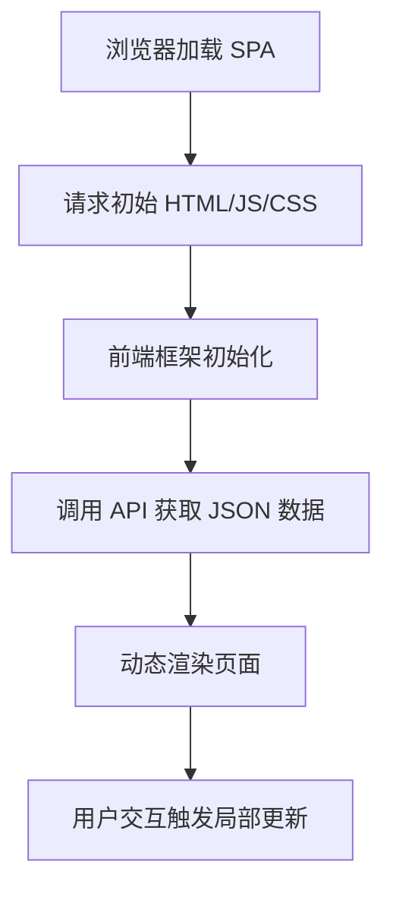
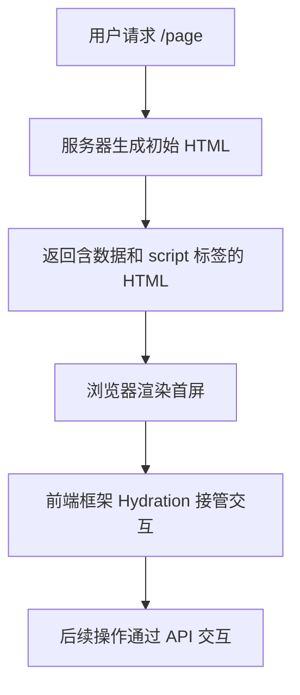

今天的前端世界充满了各种术语：MPA、SPA、CSR、SSR、SSG、Hydration、同构、岛屿架构……它们并非彼此独立的概念，而是 Web 应用在“**如何渲染页面**”和“**如何进行页面导航**”这两个核心问题上，不断权衡、融合的结果。

要真正理解这套图谱，我们需要先抓住两条主线：

1. **渲染位置**：页面的 HTML 内容**在哪里生成**？
   - **服务端**：Server-Side Rendering (SSR)
   - **客户端**：Client-Side Rendering (CSR)
   - **构建时**：Static Site Generation (SSG)

2. **导航方式**：页面切换时**浏览器怎么做**？
   - **服务端路由**：整页刷新，重新请求新 HTML
   - **前端路由**：单页无刷新，局部替换内容

几乎所有架构模式，都是这两条线不同组合的结果。

---

## 目录

1. [初代架构：传统 MPA（多页应用）](#1 初代架构传统-mpa多页应用)
2. [前端革命：SPA + CSR（单页应用与客户端渲染）](#2 前端革命spa--csr单页应用与客户端渲染)
3. [性能与 SEO 的回归：SSR（服务端渲染）重生](#3 性能与-seo-的回归ssr服务端渲染重生)
4. [混合时代：Hybrid 模式与现代 SPA](#4 混合时代hybrid-模式与现代-spa)
5. [构建时渲染：SSG（静态站点生成）与 Jamstack](#5 构建时渲染ssg静态站点生成与-jamstack)
6. [MPA 的现代化：岛屿架构与新 MPA 运动](#6 mpa-的现代化岛屿架构与新-mpa-运动)
7. [基础设施：Node.js、Vite、框架与 UI 库的角色](#7 基础设施nodejsvite框架与-ui-库的角色)
8. [SSG 与静态托管平台](# SSG 与静态托管平台)
9. [Vercel快速部署网站+国内访问](# Vercel快速部署网站+国内访问)

---

## 1 初代架构：传统 MPA（多页应用）

在 Web 早期，几乎所有网站都是 **MPA（Multi-Page Application，多页应用）**。它的本质是：

- **每个 URL 对应一个独立的 HTML 页面文件**（或由后端动态生成的页面）。
- 用户每次点击链接、跳转到新页面，浏览器都会**向服务器发起一次完整的 HTTP 请求**，获取新的 HTML、CSS、JavaScript 资源，然后**整页刷新**。

### 工作原理

1. 用户访问一个 URL（例如 `/products`）。
2. 浏览器向服务器发送 `GET /products` 请求。
3. 服务器处理请求，从数据库获取数据，通过模板引擎（如 JSP、Thymeleaf、PHP、ASP.NET）**渲染出完整的 HTML 页面**。
4. 服务器返回该 HTML 给浏览器。
5. 浏览器重新渲染整个页面。

### 核心特点

- **路由为服务端路由**：URL 变化一定触发 HTTP 请求，服务器根据路径返回对应页面。
- **后端主导渲染**：页面内容在服务端组装完成，前端仅负责展示和少量交互。
- **技术栈**：Spring MVC、Ruby on Rails、ASP.NET、Laravel + 模板引擎（Thymeleaf、Freemarker、Blade 等）。

### 例子：Spring MVC + Thymeleaf

通过 **Spring MVC 控制器**将数据传递给模板：

```java
@Controller
public class ProductController {
    @GetMapping("/product/{id}")
    public String getProduct(@PathVariable int id, Model model) {
        Product product = productService.getProduct(id);
        model.addAttribute("product", product);
        return "product"; // 对应 product.html 模板，不需要加 .html 后缀
    }
}
```

```html
<!-- product.html (Thymeleaf) -->
<div th:text="${product.name}"></div>
<p th:text="${product.description}"></p>
```

### 缺点

- **页面跳转慢**：每次跳转都要重新请求并重建整个页面，出现白屏或闪烁。
- **交互性差**：任何数据更新或交互往往需要整页刷新，无法实现如实时搜索、动态表单这类现代体验。
- **前后端耦合**：前端逻辑与后端模板强绑定，难以独立开发和部署。

**但是，MPA 的模式天然对 SEO 友好**，因为每个页面返回的就是完整的 HTML，搜索引擎爬虫可以直接读取所有内容。

---

## 2 前端革命：SPA + CSR（单页应用与客户端渲染）

随着 JavaScript 引擎性能提升和 AJAX 技术成熟，一种新架构崛起：**SPA（Single Page Application，单页应用）+ CSR（Client-Side Rendering，客户端渲染）**。

### SPA 的定义核心

**SPA 的核心是“单页 + 前端路由”**，它不关心首屏是怎么渲染的，而是关心**整个应用只有一个 HTML 壳子，后续所有导航都不需要整页刷新**。

- **单页**：整个应用只有一个 `index.html` 入口文件。
- **前端路由**：URL 变化（如从 `/home` 到 `/about`）不会触发浏览器向服务器请求新 HTML，而是由 **JavaScript 前端路由库** 拦截链接点击，利用浏览器 History API（`pushState`、`replaceState`）无刷新改变地址栏，并动态渲染对应组件。

### CSR 的渲染过程

1. **初始加载**：
   - 浏览器请求根路径（如 `/`）
   - 服务器返回一个极简的 `index.html`（通常只有一个 `<div id="root"></div>`）
   - 浏览器下载所有 JavaScript 资源（应用代码、框架、依赖库）
   - 前端框架初始化，根据当前 URL 渲染对应的视图
2. **路由切换**：
   - 用户点击链接时，前端路由库（如 React Router、Vue Router）**拦截**默认行为
   - 通过 History API 更新 URL（`history.pushState()`）
   - 根据新 URL 加载对应的组件
   - 仅更新 DOM 中需要变化的部分
3. **数据获取**：
   - 组件挂载后，通过 Fetch API 或 Axios 请求 JSON 数据
   - 将数据绑定到组件状态
   - 前端模板引擎（JSX、Vue 模板）将数据渲染为 DOM
   - 通过虚拟 DOM diff 算法最小化 DOM 操作

### 例子：前后端分离（Spring Boot + React/Vue）

SPA 架构催生了**前后端完全分离**的开发模式

```
┌─────────────┐           ┌─────────────┐
│   前端      │           │   后端      │
│  (Client)   │           │  (Server)   │
├─────────────┤           ├─────────────┤
│ React/Vue   │           │ Spring Boot │
│ Angular     │           │ Node.js     │
│ Svelte      │           │ Django      │
├─────────────┤           ├─────────────┤
│ 路由管理    │           │ 业务逻辑    │
│ 状态管理    │           │ 数据访问    │
│ UI 组件     │           │ 安全控制    │
├─────────────┤           ├─────────────┤
│ REST/GraphQL│──────────▶│ REST/GraphQL│
│ API 客户端  │           │ API 服务端  │
└─────────────┘           └─────────────┘
```

前端：页面的渲染者 (Vue.js)

```javascript
export default {
  // data：定义当前页面需要用到的“变量”。这里定义了一个空数组 products，准备用来存放等会儿拿到的商品数据
  data() {
    return { products: [] }; 
  },
  
  // created：Vue 的生命周期钩子。意思是“当这个页面组件被创建出来的时候，立刻执行下面的代码”
  async created() {
    // 1. 发起网络请求！去敲后端的门（fetch 是浏览器自带的发请求的方法）
    const res = await fetch('/api/products'); 
    
    // 2. 把后端返回的原始数据解析成 JavaScript 能读懂的 JSON 对象，并赋值给上面定义的 products 变量
    this.products = await res.json(); 
  }
}
```

页面一加载，它就跑到 `/api/products` 这个地址，把后端准备好的 JSON 数据拉回来，存进自己的 `products` 变量里。随后，你在 HTML 模板中写的 `v-for="product in products"` 就会自动根据这些数据生成网页上的商品卡片。

后端：数据的提供者 (Spring Boot)

```java
// 告诉 Spring Boot：这是一个处理 HTTP 请求的控制器，并且返回的数据直接作为响应体（而不是跳转页面）
@RestController 
// 设定基础访问路径：所有这个类里的接口，前面都要加上 /api/products
@RequestMapping("/api/products") 
public class ProductApiController {
    // 注入业务逻辑层（用来真正从数据库拿数据的）
    @Autowired
    private ProductService productService; 

    // 监听前端的 GET 请求。完整路径是：/api/products
    @GetMapping 
    public List<Product> getProducts() {
        // 调用业务层获取所有的产品数据，返回的是一个 Java 对象列表
        return productService.getAllProducts();
    }
}
```

### 优势

- **流畅的页面切换**：无整页刷新，体验接近原生 App。
- **前后端分离**：前端独立开发、部署，后端专注提供 API。
- **动态交互能力强**：非常适合复杂交互的应用。

### 缺点

- **首屏加载慢**：必须等 JS 下载、解析、执行完毕才能看到内容，白屏时间长。
- **SEO 问题**：爬虫抓取时，`<div id="root"></div>` 里什么都没有，内容无法被索引（虽然后来 Google 能执行 JS，但效果和稳定性仍不如直接提供 HTML）。
- **首次渲染耗时**：浏览器执行大量 JS 来构建页面，移动设备上尤其明显。

**流程图：纯 CSR SPA**



这一时期的 SPA，**“SPA = CSR”** 的印象根深蒂固。因为几乎所有 SPA 框架都是这么做的。但很快，首屏性能和 SEO 的问题催生了服务端渲染的回归。

---

## 3 性能与 SEO 的回归：SSR（服务端渲染）重生

随着 SPA 的普及，其 SEO 和首屏性能问题日益凸显。SSR（Server-Side Rendering）并非新技术，但在现代前端框架中获得了新生：

- **SEO 需求**：内容型网站（新闻、电商、博客）必须对搜索引擎友好
- **性能需求**：移动端用户占比增加，网络条件不稳定
- **用户体验**：用户期望即时反馈，无法容忍长时间白屏
- **技术成熟**：Node.js 使得 JavaScript 可以在服务端运行

### 新 SSR 的工作原理—同构

现代 SSR 不是简单的 HTML 生成，而是一个**同构（Isomorphic）** 过程，代码既能在服务端运行，也能在客户端运行。

1. **服务端渲染阶段**：
   - 浏览器请求 URL
   - Node.js 服务器接收请求
   - 前端框架（如 Next.js）在服务端执行组件渲染
   - 组件中的数据获取逻辑（如 `getServerSideProps`）执行
   - 生成包含实际数据的 HTML 字符串
   - 返回完整的 HTML 响应，包含预注入的数据和 CSS
2. **客户端水合（Hydration）阶段**：
   - 浏览器解析 HTML，显示内容（首屏快速可见）
   - 下载 JavaScript 资源
   - 前端框架执行，接管已渲染的 DOM
   - 将事件监听器绑定到 DOM 元素
   - 将服务端注入的数据同步到客户端状态
   - 应用变为完全交互式的 SPA
3. **后续交互阶段**：
   - 路由切换通过前端路由完成
   - 数据获取通过客户端 API 调用
   - 保持 SPA 的流畅体验

**关键点**：服务端渲染的不是模板，而是**和客户端同一套组件代码**（这就是“同构”）。

**流式 SSR（Streaming SSR）**：服务器一旦渲染出 HTML 的**开头部分**（比如 `<html><head>...` 和页面骨架），就立刻发送给浏览器；接着继续渲染剩余内容，每完成一小块就再发送一小块。浏览器可以**边接收边显示**，用户能更早看到页面框架或占位符，感知性能大幅提升。

### 水合（Hydration）关键机制

水合是 SSR 的核心魔法，它让服务端渲染的静态 HTML "活" 起来。其工作原理：

```javascript
// 伪代码：水合过程
function hydrate(rootElement, serverRenderedHTML) {
    // 1. 解析服务端渲染的 HTML
    const serverDOM = parseHTML(serverRenderedHTML);
    
    // 2. 在客户端渲染相同组件（不实际插入 DOM）
    const clientVNode = renderComponent(App);
    
    // 3. 比对服务端 DOM 和客户端 VNode
    const differences = diff(serverDOM, clientVNode);
    
    // 4. 仅修补差异，而非重新渲染整个页面
    patch(rootElement, differences);
    
    // 5. 绑定事件监听器
    attachEventListeners(rootElement);
    
    // 6. 标记水合完成
    markAsHydrated(rootElement);
}
```

1. 服务端渲染的 HTML 包含内容（如用户列表），也包含 `<script src="/app.js"></script>` 标签。
2. 浏览器下载并执行 `app.js`（即你用 React/Vue 编写、并由框架打包出的客户端 JavaScript 代码）。
3. 前端框架（React/Vue）在客户端启动，
   1. **解析已有 DOM**：客户端的 React/Vue 代码执行后，会遍历服务端生成的 DOM 树。
   2. **建立内部状态树**：框架会根据已有 DOM 结构，在内存中构建自己的虚拟 DOM（或响应式系统）。
   3. **绑定事件监听器**：将组件中定义的 `onClick`、`onChange` 等事件处理函数绑定到对应的 DOM 节点上。
   4. **关联组件状态**：将组件的 state、ref、context 等与 DOM 节点关联，使后续状态变化能驱动 UI 更新。
   5. **接管后续渲染**：Hydration 完成后，页面的所有交互、路由切换、数据请求、局部更新完全由客户端框架接管。

**Hydration 是纯客户端行为，不发起网络请求**。它只是把框架的“灵魂”注入到服务端已经建好的“躯壳”中。

**Hydration 与客户端 fetch 的区别**

| 维度     | Hydration                    | 客户端 fetch            |
| -------- | ---------------------------- | ----------------------- |
| 目的     | 激活交互（绑定事件）         | 获取新数据              |
| 网络请求 | 无                           | 有                      |
| 发生时机 | JS 加载后自动执行            | 用户操作或路由切换时    |
| 例子     | 让按钮从“点不动”变成“能点击” | 点击“加载更多”去拿 JSON |

因此，SSR 的页面流程是：**服务端发来带内容的 HTML → 浏览器展示首屏 → Hydration 激活交互 → 之后通过 API 交互获取新数据**。



### 例子：Next.js 服务端渲染页面

```javascript
// getServerSideProps 是 Next.js 提供的服务端渲染函数
// 它会在每次请求该页面时，在服务器端运行，用于获取页面所需的数据
export async function getServerSideProps() {
  // 这里的代码只运行在 Node.js 服务器上，不会暴露给浏览器
  // 可以直接调用后端 API、读取数据库、访问文件系统等
  
  // 从外部 API 获取产品数据（这里的 fetch 是 Node.js 环境的，不是浏览器中的 fetch）
  const res = await fetch('https://api.example.com/products');
  // 将响应解析为 JSON 格式
  const products = await res.json();
  
  // 返回一个包含 props 的对象，这些 props 将会传递给页面组件
  // 页面组件可以通过参数接收这些数据
  return { props: { products } };
}

// 页面组件：接收 getServerSideProps 返回的 props 作为参数
// 当用户访问该页面时，Next.js 会先用 getServerSideProps 获取数据，
// 然后用这些数据在服务器上渲染出完整的 HTML，最后发送给浏览器
export default function Home({ products }) {
  return (
    <div>
      {/* 遍历 products 数组，为每个产品生成一个带 key 的 div，显示产品名称 */}
      {products.map(p => <div key={p.id}>{p.name}</div>)}
    </div>
  );
}
```

这个 Next.js 页面（通常位于 `pages/index.js` 或 `pages/products.js`）会在**每次用户请求该页面时，在服务器上预先获取外部 API 的数据**，然后将数据注入到 React 组件中，生成完整的 HTML 返回给浏览器。

### 服务端路由与前端路由的共存

在 SSR 模式下，**首次访问是服务端路由**（浏览器请求页面地址，服务器返回 HTML），**后续导航则变为前端路由**（由 React Router 等接管，不再整页刷新）。这就形成了混合路由模式。

### SSR 的缺点

- **服务器压力大**：每次页面请求都需要服务器动态渲染，高并发下消耗 CPU/内存。
- **交互延迟**：首屏 HTML 可见后，用户可能无法立即交互（因为 JS 还在加载，Hydration 尚未完成）。
- **开发复杂度高**：需要同时处理服务端和客户端环境差异（如 `window` 对象只在客户端存在）。

## 4 混合时代：Hybrid 模式与现代 SPA

当 CSR 和 SSR 的优缺点了然于胸后，开发者自然会想：**能否按页面粒度选择渲染策略？** 这就是 **Hybrid（混合）模式**。

### 现代 SPA = SSR + CSR 的按需组合

- 对于内容为主、需要 SEO 的页面（如博客、商品详情），使用 **SSR** 预渲染首屏。
- 对于高度交互、不关心 SEO 的页面（如后台管理、仪表盘），使用 **CSR** 在客户端动态渲染。
- 整个应用仍然保持 **SPA 的前端路由**，导航体验流畅。

现代框架（Next.js、Nuxt、SvelteKit）对此提供了原生支持，你可以通过配置或文件名（如 `.server.js`、`.client.js`）来决定页面渲染方式。

### 现代 SPA 的核心特征

- **同构渲染**：一套代码既能在服务端执行生成 HTML，也能在客户端执行接管交互。
- **后端提供页面级渲染**：除 RESTful API 外，还负责部分页面的 SSR 或 SSG。
- **Hydration**：服务端渲染的静态页面在客户端被激活。
- **代码分割**：JS 不会一次性全部加载，而是按路由拆分，减少首屏体积。

此时，**“SPA = CSR” 的等式彻底被打破**，SPA 成为了一种**导航模式**（单页 + 前端路由），渲染策略则灵活多变。

```
my-app/
├── app/
│   ├── (marketing)/
│   │   ├── layout.tsx          # 营销页面布局
│   │   ├── page.tsx            # 首页 (SSG)
│   │   ├── about/
│   │   │   └── page.tsx        # 关于页 (SSG)
│   │   └── contact/
│   │       └── page.tsx        # 联系页 (SSG)
│   ├── dashboard/
│   │   ├── layout.tsx          # 仪表盘布局 (需要认证)
│   │   ├── page.tsx            # 仪表盘首页 (SSR)
│   │   ├── settings/
│   │   │   └── page.tsx        # 设置页面 (CSR)
│   │   └── components/         # 仪表盘组件
│   ├── products/
│   │   ├── page.tsx            # 产品列表 (ISR)
│   │   ├── [id]/
│   │   │   └── page.tsx        # 产品详情 (SSR)
│   │   └── search/
│   │       └── page.tsx        # 搜索页面 (CSR)
│   ├── api/                    # API 路由
│   │   ├── auth/
│   │   │   └── route.ts        # 认证 API
│   │   └── products/
│   │       └── route.ts        # 产品 API
│   ├── layout.tsx              # 根布局
│   ├── providers.tsx           # 全局 Provider
│   └── page.tsx                # 根页面重定向
├── components/
│   ├── layout/
│   │   ├── Header.tsx          # 通用头部
│   │   ├── Footer.tsx          # 通用底部
│   │   └── ThemeProvider.tsx   # 主题提供者
│   ├── ui/                     # UI 组件
│   │   ├── Button.tsx          # 按钮组件
│   │   ├── Card.tsx            # 卡片组件
│   │   └── Modal.tsx           # 模态框组件
│   └── features/               # 功能组件
│       ├── Cart.tsx            # 购物车组件
│       └── Search.tsx          # 搜索组件
├── lib/
│   ├── auth.ts                 # 认证工具
│   ├── db.ts                   # 数据库连接
│   ├── api.ts                  # API 客户端
│   └── utils.ts                # 工具函数
├── styles/
│   ├── globals.css             # 全局样式
│   └── themes/                 # 主题样式
├── public/                     # 静态资源
├── .env                        # 环境变量
├── next.config.js              # Next.js 配置
├── tsconfig.json               # TypeScript 配置
└── package.json                # 项目依赖
```

---

## 5 构建时渲染：SSG（静态站点生成）与 Jamstack

SSR 虽然快，但每次请求都要动态渲染，服务器压力大。对于一些内容不常变化的站点（如博客、文档），更好的方案是 **SSG（Static Site Generation，静态站点生成）**。

**框架支持：**

- Next.js: `getStaticProps` + `getStaticPaths`
- Nuxt.js: `generate` 模式
- Gatsby: 基于 GraphQL 的数据层
- Astro: 专注静态站点的新兴框架

### SSG 原理

- **构建时**（而不是请求时），将整个站点的所有页面预渲染为纯 HTML、CSS、JS 静态文件。
- 部署时直接把这些静态文件放到 CDN 或静态服务器上。
- 用户访问时，服务器直接返回对应的 HTML 文件，速度极快。

### 比喻理解

| 渲染模式 | 比喻                                             |
| -------- | ------------------------------------------------ |
| **SSG**  | 提前把每个房间装修好，放在仓库，有人来直接给钥匙 |
| **SSR**  | 有人敲门时现场装修，装修完再让他进               |
| **CSR**  | 只给个空房间，让用户自己装                       |

SSG 兼具了 **SEO 友好** 和 **超高首屏性能** 的优点，但缺陷是内容更新必须重新构建整个站点，不适合实时数据。因此，实践中常结合 **增量静态生成 (ISR)** 或 **按需重新验证**，只重建变化的部分。

---

## 6 MPA 的现代化：岛屿架构与新 MPA 运动

MPA 并没有消亡，反而以全新的形态回归。现代 MPA 不再是传统的整页刷新 + 后端模板，而是吸收了 SPA 的优势，并发展出**岛屿架构（Islands Architecture）**。

### 新 MPA 的特性

- 每个路由仍然是独立的 HTML 页面（服务端路由），但页面切换可以**通过 AJAX 无刷新更新**（如使用 Turbo、htmx），或通过过渡动画平滑过渡。
- 页面中的交互部分（如搜索建议、点赞按钮）可以加载对应的 JavaScript 组件，而这些组件**彼此独立，互不影响**。
- 默认情况下，页面中 90% 的 HTML 是零 JavaScript 的纯静态内容，只有那些需要交互的“岛屿”才会加载相应的 JS。

### 代表性框架

- **Astro**：默认输出多个 HTML 页面（MPA），但允许你在页面中嵌入 React、Vue、Svelte 等组件作为交互岛屿。岛屿独立渲染，互不干扰。
- **htmx + 任何后端模板**：通过 HTML 属性声明 AJAX 请求，服务器返回 HTML 片段直接替换 DOM，实现局部无刷新，但整体仍为 MPA。
- **Hotwire（Turbo）**：服务器返回 HTML，Turbo Drive 拦截链接点击，用 fetch 获取新页面 HTML 并替换 `<body>`，实现类 SPA 的平滑导航，但本质仍是 MPA。

### 岛屿架构的优势

- **首屏极快**：大部分内容无需 JavaScript，只加载必要交互的少量 JS。
- **SEO 天然友好**：每个页面都是完整的 HTML。
- **简化开发**：不需要复杂的同构逻辑，按传统后端开发，交互按需加“岛屿”。

**新 MPA 不是倒退，而是对“默认高性能”的追求。** 它更适合内容为主的网站，而重交互应用仍然更适合 SPA 或混合模式。

---

## 7 基础设施：Node.js、Vite、框架与 UI 库的角色

理解了架构演进，我们需要知道这些模式依赖怎样的工程基础设施。

### Node.js：地基

Node.js 彻底改变了前端开发范式，使 JavaScript 超越浏览器限制：

**核心能力：**

- **服务端 JavaScript**：使用同一语言编写前后端代码
- **包管理生态**：npm 成为最大的开源库注册表
- **构建工具基础**：Webpack、Vite、Rollup 等都依赖 Node.js
- **SSR 运行时**：在服务器上执行 React/Vue 组件渲染

**运行时环境对比：**

| 环境        | 用途        | 全局对象 | 模块系统            | I/O 能力             |
| :---------- | :---------- | :------- | :------------------ | :------------------- |
| **浏览器**  | 客户端交互  | `window` | ESM (import/export) | 有限 (Fetch API)     |
| **Node.js** | 服务端/构建 | `global` | CommonJS + ESM      | 完整 (fs, net, http) |

**Node.js 在现代前端中的角色：**

1. **开发服务器**：提供本地开发环境，支持热更新
2. **构建工具**：编译、打包、优化前端资源
3. **SSR 服务器**：运行时渲染 React/Vue 组件
4. **API 服务器**：提供数据接口（Next.js API Routes）
5. **工具链**：ESLint、Prettier、TypeScript 编译器

### Vite：构建总工程师

**Vite 是一个前端构建工具和开发服务器**，它本身基于 Node.js。

**开发时**：

- 它启动一个基于原生 ESM 的开发服务器，把 TypeScript、`.vue`、`.astro` 等源码文件按需转译为浏览器可识别的 JS/CSS，实现**秒级冷启动**和**毫秒级热更新（HMR）**。

**生产时**：

- 它调用 Rollup 对你的代码进行打包、压缩、摇树优化，生成最终部署的静态文件（或两套产物：客户端 + 服务端）。

> **插件钩子**是 Vite 暴露给插件开发者的 API 接口。Vite 在构建流程的每一个环节（比如：服务器启动前、文件读取时、代码转换时、打包结束时）都埋下了“钩子”。

Vite 与架构的关系：

- **SPA**：Vite 默认构建纯客户端 SPA。
- **SSR**：Vite 提供底层 API（如 `ssrLoadModule`），上层框架（Nuxt、SvelteKit、Astro 等）基于它实现服务端渲染。
- **新 MPA / 岛屿架构**：Astro、SvelteKit 等同样使用 Vite 作为构建引擎。

**关键点**：Vite 本身不直接提供 SSR 或 SPA，它是一个**引擎**，为各种渲染模式提供编译和开发支持。

### 框架与 UI 库的分工

**React/Vue 本身**：它们是**UI 库**，提供了**同构渲染的核心能力**。

- **在服务端**：它们可以把组件“渲染”成 HTML 字符串。React 用的是 `renderToString()`，Vue 用的是 `createSSRApp()`。
- **在客户端**：它们可以对服务端生成的 HTML 进行 **Hydration**，接管交互。React 用的是 `hydrateRoot()`，Vue 用的是 `app.mount()`。

**UI 组件库（Ant Design、Element Plus、shadcn/ui）**：

- 提供现成的按钮、表单、模态框等样式组件。
- 不参与路由或渲染模式，只是“积木”。

> 1. **最底层：React**
>    负责页面的渲染逻辑、事件响应和数据驱动视图更新。它是所有组件运行的环境。
> 2. **中间层：Radix UI + Tailwind CSS（shadcn 的幕后功臣）**
>    - **Radix UI**：提供不带任何样式的“无头组件”。它只负责复杂的交互逻辑和无障碍访问（比如点击下拉菜单怎么弹出、键盘怎么控制焦点），但不决定它长什么样。
>    - **Tailwind CSS**：负责纯粹的视觉样式（颜色、间距、圆角、阴影等）。
> 3. **最上层：shadcn/ui**
>    它把底层的 Radix UI（逻辑）和 Tailwind CSS（样式）完美地组装在一起，封装成一个个开箱即用的 React 组件（如 `<Button />`, `<Dialog />`）。

**Next.js/Nuxt 等框架**：它们是**应用框架**，在 React/Vue 的基础上，提供了**一整套工程化解决方案**，让你能真正把同构渲染跑起来。

- **数据获取的“编排者”**：框架提供了**约定好的数据获取方法**（如 Next.js 的 `getServerSideProps`、Nuxt 的 `asyncData`）。**框架负责在服务端渲染前调用这些方法，拿到数据，注入组件，然后再调用 React/Vue 的 `renderToString()`**。没有框架，你就需要手写一个 Node.js 服务来完成这个流程。
- **路由系统**：处理服务端和客户端路由的统一。
- **构建和部署**：打包出服务端和客户端两套代码。

例如，一个现代 SSR 项目可以是：**Next.js（框架） + React（UI 库） + shadcn（组件库） + Vite（底层构建工具）**，全部运行在 Node.js 之上。

## SSG 与静态托管平台

创建一个博客，有很多开源的静态站点生成器（Static Site Generator, SSG）可以选择

> [Hexo](https://hexo.io/)：老牌的静态站点生成器，生态成熟，主题选择丰富，适合快速上手。 
>
> [Hugo](https://gohugo.io/)：Go 语言编写，速度极快，支持多语言，部署简单。 
>
> [Astro](https://astro.build/)：近几年兴起的新星，支持部分渲染、MDX、整合 React/Vue/Svelte 等框架，非常适合写博客或文档。 
>
> Next.js：严格意义上不算 SSG，但它提供 next export 静态导出能力，和 Vercel 原生契合，能做更复杂的动态功能。
>
> VuePress 和 VitePress 都是 **基于 Vue 的静态站点生成器**，它们由 Vue.js 官方团队维护，但底层构建工具不同。VuePress 基于 **Vue 2 + Webpack** 构建，VitePress 基于 **Vue 3 + Vite** 构建。
>
> 这些工具允许你用 Markdown 写文章，然后一键生成整站的静态文件。

| 路由方式                    | 类型              | 实现原理                                    | Astro 实现                        | 页面刷新 | 典型技术                          |
| :-------------------------- | :---------------- | :------------------------------------------ | :-------------------------------- | :------- | :-------------------------------- |
| **静态资源路由**            | 纯静态站点（SSG） | 浏览器请求静态文件，无需服务端运行时        | **默认模式 (SSG)**                | 是       | Astro 默认行为（构建时生成 HTML） |
| **服务端路由**              | 传统 MPA 或 SSR   | 每次导航向服务器请求新 HTML，服务器动态生成 | **SSR 模式** (`output: 'server'`) | 是       | Astro + 适配器 + 服务端运行时     |
| **类前端路由 (动画增强)**   | MPA + SPA 体验    | 浏览器原生 API 为 MPA 导航添加过渡动画      | **View Transitions API**          | 是       | `@view-transition` CSS at-rule    |
| **真前端路由 (客户端渲染)** | 完整 SPA          | 客户端路由库拦截并接管导航，无整页刷新      | **`<ClientRouter />` 组件**       | 否       | `<ClientRouter />`                |

- Astro 默认的 SSG 模式是 **静态资源路由**，不是服务端路由。
- 只有在显式开启 SSR 模式时，才是服务端路由。

GitHub Pages / Netlify / Vercel 是**静态托管平台**

| 平台         | 类型                      | 特点                                                         |
| ------------ | ------------------------- | ------------------------------------------------------------ |
| GitHub Pages | 静态网站托管              | 免费、与 GitHub 仓库集成紧密，适合文档、博客、简单项目展示；不支持服务端逻辑。 |
| Netlify      | 静态网站托管 + Serverless | 支持自动构建、CDN、表单处理、边缘函数（Edge Functions）、身份验证等。 |
| Vercel       | 静态网站托管 + Serverless | 专为前端优化，对 Next.js 等框架有深度集成，也支持边缘函数、API Routes。 |

### 各静态托管平台推荐的部署方式

**vite 部署官方教程**：https://vite.dev/guide/static-deploy

1、Vercel

- **直接连接 Git 仓库**（GitHub / GitLab / Bitbucket）
- Vercel 会自动：
  - 监听 `main`/`master` 分支推送
  - 自动运行 `npm run build`
  - 自动部署 `dist` 目录（或你指定的输出目录）
- 支持预览部署（每个 PR 自动生成预览链接）

> 📌 **推荐方式：直接用 Vercel Dashboard 导入项目，零配置即可部署。**

2、Netlify

- 同样通过 **连接 Git 仓库** 实现自动部署
- 在 Netlify 后台设置：
  - 构建命令：`npm run build`
  - 发布目录：`dist`
- 自动处理 SPA 路由（默认支持 `/* → /index.html` 重写）

> 📌 **推荐方式：在 Netlify 网站一键导入 Git 项目，自动 CI/CD。**

3、**GitHub Pages**

用 **GitHub Actions（推荐）**

- 因为 GitHub Pages **本身不提供构建环境**（只托管静态文件）
- 所以你需要用 GitHub Actions：
  - 在 CI 中运行 `npm run build`
  - 把生成的 `dist` 推送到 `gh-pages` 分支 或 `docs/` 目录
- 官方模板（`.github/workflows/deploy.yml`）非常成熟，可以从上方教程中找到

注意上方教程默认用的是npm，如果改用pnpm，则需要参考[pnpm官网给出的模版](https://pnpm.io/zh/continuous-integration/)，合二为一，参考[给傻子的GitHub Actions前端教程](https://www.bilibili.com/video/BV19wmwB1EEM/?spm_id_from=333.1387.favlist.content.click&vd_source=1cb3877417a5472371e3e0e5fa4272e0)，其中的deploy.yml配置文件如下：

```yml
# Simple workflow for deploying static content to GitHub Pages
name: Deploy static content to Pages

on:
  # Runs on pushes targeting the default branch
  push:
    branches: ['main']

  # Allows you to run this workflow manually from the Actions tab
  workflow_dispatch:

# Sets the GITHUB_TOKEN permissions to allow deployment to GitHub Pages
permissions:
  contents: read
  pages: write
  id-token: write

# Allow one concurrent deployment
concurrency:
  group: 'pages'
  cancel-in-progress: true

jobs:
  # Single deploy job since we're just deploying
  deploy:
    environment:
      name: github-pages
      url: ${{ steps.deployment.outputs.page_url }}
    runs-on: ubuntu-latest

    strategy:
      matrix:
        node-version: [20]

    steps:
      - name: Checkout
        uses: actions/checkout@v5

      - name: Install pnpm
        uses: pnpm/action-setup@v4
        with:
          version: 10

      - name: Use Node.js ${{ matrix.node-version }}
        uses: actions/setup-node@v4
        with:
            node-version: ${{ matrix.node-version }}
            cache: "pnpm"

      - name: Install dependencies
        run: pnpm install

      - name: Build
        run: pnpm run build
        
      - name: Setup Pages
        uses: actions/configure-pages@v5
      - name: Upload artifact
        uses: actions/upload-pages-artifact@v4
        with:
          # Upload dist folder
          path: './dist'
      - name: Deploy to GitHub Pages
        id: deployment
        uses: actions/deploy-pages@v4
```

**附加提示：Vite 项目部署注意事项**

无论用哪种平台，记得：

1. **配置 `base` 路径**（如果部署到子路径，如 `https://user.github.io/repo/`）：

   ```js
   // vite.config.js
   export default {
     base: '/repo-name/' // GitHub Pages 必须设，Vercel/Netlify 通常不需要
   }
   ```

2. **处理客户端路由**（如 Vue Router history 模式）：

   - Vercel/Netlify：配置重写规则（见前文）
   - GitHub Pages：建议改用 hash 模式，或用 404 重定向 hack（不完美）

## Vercel快速部署网站+国内访问

利用 Vercel，Cloudflare 平台进行代理，实现 cdn 加速国内代理，使得网站在国内能够访问

## 使用静态站点生成器Astro构建一个部署在vercel的博客

[Vercel](https://github.com/vercel)是一家总部在美国的公司，前身叫 Zeit。

它提供了一个云端平台，让开发者可以一键部署前端项目，尤其是静态站点和 Serverless 应用。

其中[Serverless](https://aws.amazon.com/cn/campaigns/serverless/)是一个国外很流行的技术，属于**云服务**，这里就不展开。

Vercel还和 [GitHub](https://github.com/)/[GitLab](https://about.gitlab.com/) 深度集成，提供了优质的**CI/CD**服务，每次`git push`的时候，都会自动重新构建、部署项目。

SSG之前介绍了，我之前有使用过[Hexo](https://hexo.io/)、[Hugo](https://gohugo.io/)，但现在切换到了[Astro](https://astro.build/)。

跟着官网的教程创建一个站点并部署在github上，然后你需要在vercel中，`add new project`打开这个项目。`import Github repository`将你的github项目导入，进入配置界面。在这里配置`框架预设`，如果你是astro就用其预设。

> deploy完成后，vercel会给你一个类似 `[项目名].vercel.app` 的域名，通过这个域名你就可以访问你的项目了（前提是开了vpn），在中国大陆一般是访问不了的。 这个时候就需要另外一个东西：Cloudflare。

## 部署到国内（阿里云购买+Cloudflare转发）

阿里云购买个性化域名 wutongyu.site

点击Vercel左侧栏的Domains，选择右上侧的Add Existing，输入购买的个性化域名


打开 Cloudflare，进入 Domains-Overview-Add domain


回到之前添加的两条域名，进行 Auto configure，分别各自增加 TXT 和 CNAME 两条 records


在 Cloudflare 点击添加的 domain，进入 DNS-Records，可以看到四条


可以看到下方有 Cloudflare Nameservers，复制这两条 NS


进入阿里云，打开域名控制台修改DNS服务器地址

1. 前往[域名产品控制台](https://dc.console.aliyun.com/?spm=5176.28197678_55416700.console-base_help.18.63045b8eO61o25)，在域名列表中找到目标域名，单击操作列的 **管理** 按钮
2. 在左侧导航栏选择 **DNS管理** 下的 **DNS修改** 菜单，单击 **修改DNS服务器** 按钮
3. 输入 **云解析 DNS** 分配的DNS服务器地址，例如：`vip1.alidns.com`、`vip2.alidns.com`，提交变更。

完成之后回到 Cloudflare 的域名Overview，可以 Check nameservers now，阿里云那边生效之后，这个页面会刷新：


